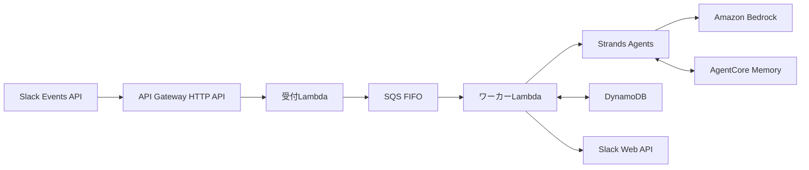

# AI Chatbot

Slackのメンションに応答する、AWS上のサーバーレスチャットボットである。
Amazon BedrockのモデルをStrands Agentsから呼び出し、会話をAmazon Bedrock AgentCore Memoryへ保存する。

## アーキテクチャ



受付LambdaはSlackの署名とイベントを検証し、正規化したメッセージをSQS FIFOへ送る。
ワーカーLambdaはスレッド単位でメッセージを処理し、Strands Agentsによる応答をSlackへ投稿する。
AgentCore Memoryが会話を保持し、DynamoDBが処理状態、再送制御、返信状態を保持する。

サーバーレス構成の判断は[ADR-001](docs/adr/001-serverless-strands-chatbot.md)、比較したハイブリッド構成は[ADR-002](docs/adr/002-hybrid-k3s-strands-chatbot.md)、個人利用の運用方針は[ADR-003](docs/adr/003-personal-use-operations.md)に記録している。

## 開発環境

[mise](https://mise.jdx.dev/)でPython、Terraform、lambroll、uv、[prek](https://prek.j178.dev/)などのバージョンを揃える。

```sh
mise install
mise exec -- prek install
```

テスト、Lambdaパッケージのビルド、全hookの検証は次のコマンドで実行する。

```sh
./run_tests.sh
mise exec -- make build
mise exec -- prek run --all-files
```

## デプロイ

TerraformがAPI Gateway、Lambda、SQS、DynamoDB、AgentCore Memory、IAM、監視リソースを管理する。
lambrollが受付LambdaとワーカーLambdaのコードおよび実行設定を配布する。
GitHub Actionsはmainへのpushでdevへデプロイし、workflow dispatchでdevまたはprodを選択できる。

初期設定、デプロイ、切り戻しは[デプロイ手順](docs/runbooks/deployment.md)に従う。
SlackアプリのRequest URLを切り替える場合は[Slack本番切り替え](docs/runbooks/slack-cutover.md)に従う。
稼働後のアラームとDLQは[アラーム対応](docs/runbooks/alerts.md)に従う。

## 利用方法

SlackチャンネルまたはスレッドでBotへメンションすると、Botが同じスレッドへ返信する。
URLと許可されたテキスト添付を読み取り対象にできる。
メンションのない発言は会話へ取り込まれず、1スレッドの回答は100回までに制限される。

## ライセンス

[MIT](https://choosealicense.com/licenses/mit/)
