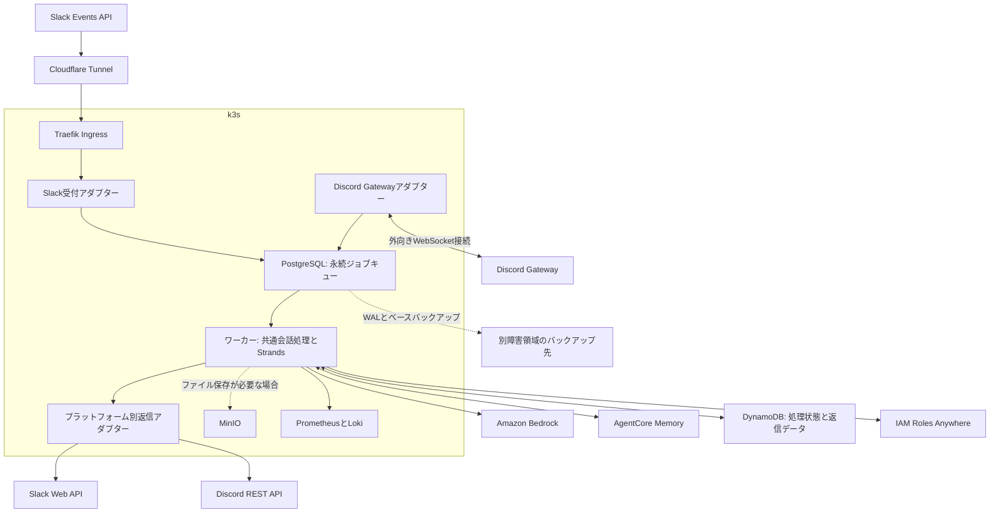

# ADR-0001: k3sとAWSによるSlack／Discordチャットボットの再構築

- 状態：Proposed alternative
- 作成日：2026-09-06
- 比較対象：[AWS中心案](0001-serverless-strands-chatbot.md)
- 対象：Discord Gatewayを常駐接続するマルチアダプター構成

## 決定案

SlackとDiscordの受付、非同期ジョブ、エージェント実行、ファイル保存をk3sに配置する。
Python版Strands Agentsを共通の会話処理に組み込み、Amazon Bedrock、Amazon Bedrock AgentCore Memory、Amazon DynamoDBはAWSで継続利用する。
SQS相当の永続ジョブキューにはPostgreSQL、S3相当のファイル保存には必要に応じてMinIOを使う。

本案とAWS中心案は同じADR-0001の比較候補であり、採用決定は保留する。
AWS中心案はSlackを対象とする現状の提案を維持し、本案ではDiscordの通常メッセージとメンションを追加する。
同じ機能範囲で費用を比べる際は、AWS中心案にもDiscord Gatewayを常駐接続する実行環境を加える。

### AWS中心案との比較

| 比較項目 | AWS中心案 | k3sとAWSのハイブリッド案 |
| --- | --- | --- |
| SlackのHTTP入口 | API Gateway HTTP API | Cloudflare TunnelとTraefik |
| 受付と推論の実行 | Lambda | k3sのDeployment |
| Discord Gateway | 常駐実行環境を追加する必要がある | 専用Deploymentで接続 |
| 永続ジョブ | SQS FIFO | PostgreSQLのジョブテーブル |
| ファイル保存を追加する場合 | S3 | MinIO |
| 推論 | Amazon Bedrock | Amazon Bedrock |
| 会話保存 | AgentCore Memory | AgentCore Memory |
| 処理結果と冪等性 | DynamoDB | DynamoDB |
| 主な基盤費用 | AWSのリクエスト数と実行時間 | 電力、ディスク、バックアップ、運用時間 |
| ローカル障害中の受付 | AWS側の受付は継続可能 | ホストや回線の停止で受付も停止 |
| キューの耐久性 | SQSが管理 | PostgreSQLとバックアップを自分で管理 |
| スケール | マネージドなイベントソース | ノード容量内でワーカーを調整 |

## 配置と責務

構成検討には既存のk3s構成資料を参照し、Cloudflare Tunnel、Traefik、CloudNativePG、MinIO、Prometheus、Lokiを利用する設計とする。
単一ノードとローカル永続ボリュームを基準に評価する。
ここでの容量や可用性は設計上の前提であり、稼働クラスタの空き容量や復旧性能はデプロイ前に実測する。

### k3s上のプロセス

| プロセス | 初期レプリカ数 | 責務 |
| --- | --- | --- |
| Slack受付 | 1 | 署名検証、ジョブの永続化、HTTP応答 |
| Discord Gatewayアダプター | 1 | WebSocket接続、イベント選別、ジョブの永続化 |
| 会話ワーカー | 1 | 同時2会話までの処理と返信 |
| PostgreSQL | 1 | ジョブと配送カーソルの保存 |
| ジョブ保守CronJob | 同時実行禁止 | 期限切れ検知、保持期限後の削除 |

受付とGatewayを推論ワーカーから分離し、モデルの応答待ちがHeartbeatやSlackの受信確認を妨げないようにする。
返信アダプターは初期版ではワーカー内のモジュールとする。
ワーカーの並列処理を増やす場合も、プラットフォームのレート制限と会話単位の排他制御を維持する。

Slack用の`POST /slack/events`だけを公開し、PostgreSQLとMinIOにはIngressを付けない。
Discord GatewayはPodから外向きに接続するため、Discordの受信用URLや公開WebSocketサーバーは不要である。
管理画面の認証とSlackのWebhook認証を分け、Slackの入口を対話型ログインやブラウザ向けチャレンジに転送しない。
署名検証に使うリクエスト本文をプロキシで書き換えない。

## マルチアダプターの契約

共通処理がプラットフォーム固有のSDKオブジェクトを受け取らないよう、受付時に共通イベントへ変換する。

### 共通イベント

| フィールド | 内容 |
| --- | --- |
| `schema_version` | イベント契約のバージョン |
| `platform` | `slack`または`discord` |
| `installation_id` | Botのインストール境界 |
| `tenant_id` | SlackワークスペースまたはDiscordサーバー |
| `event_id` | SlackイベントIDまたはDiscordメッセージID |
| `conversation_id` | アダプターが導出した会話単位 |
| `user_id` | プラットフォーム内の投稿者ID |
| `source_message_id` | 元投稿の識別子 |
| `occurred_at`と`received_at` | 投稿時刻と受信時刻 |
| `text`と`attachments` | 本文と添付参照 |
| `reply_target` | プラットフォームと型を持つ返信先 |

`reply_target`はSlackならchannelとthread timestamp、Discordならchannelと元message IDを保持する。
トークンは共通イベントやログに入れず、インストール情報から返信アダプターが取得する。
すべての外部IDは文字列として保持する。
Slackの`conversation_id`はchannelとthread timestampから導出し、thread timestampがない投稿では元投稿のtimestampを使う。

重複排除キーは環境、platform、installation、tenant、event IDから導出する。
会話キーは環境、platform、installation、tenant、conversation IDを曖昧さのない形式で連結し、SHA-256にする。
同じ数値のIDがSlackとDiscordに存在しても混ざらないようにする。
プラットフォームをまたぐユーザー同定と会話共有は初期版に含めない。

### アダプター境界

| インターフェース | 責務 |
| --- | --- |
| 受信アダプター | 認証、許可範囲の確認、正規化、永続化 |
| 会話サービス | 履歴復元、推論、ツール実行、処理状態 |
| 添付アダプター | 認可された添付の取得とサイズ検査 |
| 返信アダプター | 表示形式、分割、投稿、更新、エラー分類 |
| ジョブストア | 投入、claim、再試行予約、隔離 |

返信アダプターは「成功と投稿ID」「明示的な再試行時刻」「恒久失敗」「投稿結果不明」を共通の結果型として返す。
投稿前に出力を各プラットフォーム向けに変換し、生成文に含まれるメンションを無効化する。
Slackの表示記法とDiscordのMarkdownを同じ文字列として扱わない。
Discordの本文は2,000文字以内に分割し、投稿と更新の両方で`allowed_mentions`を明示する。
分割位置と各投稿IDをDynamoDBへ保存し、再試行では未送信部分だけを対象にする。[Discord Message API](https://docs.discord.com/developers/resources/message)

## Slackの受信

AWS中心案と同じく、生本文のHMAC署名と5分の時刻差を検証する。
`team_id`と`api_app_id`を許可リストで照合し、人間の`app_mention`だけを投入する。
`url_verification`には署名検証後にchallengeを返す。

通常イベントはPostgreSQLのジョブ投入トランザクションがcommitした後にHTTP 200を返す。
DB書き込みのタイムアウトは1秒を初期値とし、失敗や結果不明では5xxを返す。
再送されたイベントは一意制約で重複排除し、永続化済みと確認できた場合に200を返す。
Slackが求める3秒以内の受信確認に対し、外部経路込みでp99 2秒未満を目標とする。[Slack Events API](https://docs.slack.dev/apis/events-api/)

プロセスのメモリへ追加した時点では受信成功としない。
ローカルDBのcommit後に200を返しても、その後のディスク喪失でジョブを失う可能性は残る。
この範囲はバックアップの復旧時点目標で扱う。

## Discordの通常メッセージとメンション

### 受信範囲と会話単位

初期版は許可したDiscordサーバー内で、明示的に登録したチャンネルとスレッドを対象にする。
DMはtenantの認可境界を追加設計してから有効にする。

| 受信モード | 対象イベント | 会話単位 |
| --- | --- | --- |
| メンションモード | Botにメンションした人間の投稿 | チャンネルIDまたはDiscordスレッドID |
| 会話専用モード | 許可した場所の人間の通常投稿 | チャンネルIDまたはDiscordスレッドID |

通常チャンネルでは会話が共有されるため、独立した話題はDiscordスレッドに分ける運用とする。
返信は受信元のチャンネルまたはスレッドへ送り、元投稿へのmessage referenceを付ける。
Discordの返信参照だけではSlackのthread timestampと同じ会話境界にならないため、参照先をたどって会話IDを推測しない。
50回答の上限に達した場合は新しいスレッドで会話を開始する。

Botには対象範囲の`VIEW_CHANNEL`、`READ_MESSAGE_HISTORY`、`SEND_MESSAGES`と、スレッド用の`SEND_MESSAGES_IN_THREADS`を付与する。
非公開スレッドはBotを参加させたものだけを対象とし、ロック済みスレッドへの返信失敗は権限エラーとして扱う。[Discordスレッドの権限](https://docs.discord.com/developers/topics/threads)

初期版は`MESSAGE_CREATE`で起動する。
Bot自身、他のBot、Webhook、システムメッセージを除外し、Bot間の応答ループを防ぐ。
編集イベントでは推論を再実行しない。
削除イベントは保存済み会話を自動削除する機能とは分け、保存先を横断する削除手順を用意する。[Discord Gateway Events](https://docs.discord.com/developers/events/gateway-events)

一般の投稿本文を読むためにMessage Content Intentを使用し、Developer Portalとクライアントの両方で有効にする。
必要なGateway intentsは`GUILDS`、`GUILD_MESSAGES`、`MESSAGE_CONTENT`を基本とし、presenceや全メンバー一覧の取得は有効にしない。
アプリの規模や認証状態に応じて必要な承認を確認する。
メンションに関する例外だけでは会話専用モードを提供できない。[discord.pyのIntents説明](https://discordpy.readthedocs.io/en/stable/intents.html)

### 接続と再接続

PythonのDiscordクライアントライブラリを使用し、Heartbeat、再接続、Resumeを管理する。
初期実装候補はdiscord.pyとし、採用バージョンを固定する。
受信コールバックはジョブの永続化までで終了し、ネットワーク処理やCPU処理でイベントループを塞がない。

GatewayにはHeartbeatとセッション再開の仕組みがあるが、永続キューへのcommitを確認するアプリケーション単位のACKはない。
同一プロセス内の一時的な切断ではResumeを試み、無効なセッションではIdentifyする。
Identifyの実行はsession start limitと再接続待機に従い、Pod再起動を連続させない。[Discord Gateway](https://docs.discord.com/developers/events/gateway)

Gatewayアダプターは1レプリカ、更新戦略は`Recreate`とする。
複数Podによる同じBot接続を初期構成で作らない。
Heartbeatの疎通と最後のDB書き込みを別メトリクスにし、DB障害中に「接続済み」だけで正常と判定しない。

Podの消失やDB書き込み前の終了では、SDKの受信済みsequenceと永続化済みジョブがずれる可能性がある。
プロセスをまたぐResumeがライブラリに標準搭載されているとは仮定せず、初期版は再接続後の限定的な履歴照合で補う。
対象チャンネルごとに走査カーソルをPostgreSQLへ保存し、直近10分を上限にページングして新着投稿を照合する。
初回登録時は登録時刻を開始点とし、過去の通常投稿へ遡って応答しない。
1チャンネル当たり1,000件を上限とし、回収した投稿を一意制約で重複排除する。
履歴APIの権限とページ上限は[Discord Message API](https://docs.discord.com/developers/resources/message)に従う。

照合中は対象会話の新規ジョブ実行を保留し、新着受信と回収分を整列してから再開する。
過去の時点ですでに後続発言を処理した場合は、古い発言を会話末尾へ自動追加せず隔離する。
10分を超える停止、上限超過、削除済み投稿、権限変更、未登録スレッドは完全回収を保証できないため、欠落の可能性を通知して再送を依頼する。
通常メッセージはInteractionsではないため、3秒以内の初回応答や15分の返信トークン制限を適用せず、Bot TokenでREST APIへ返信する。

## PostgreSQLによる永続ジョブキュー

CloudNativePGが管理するアプリ専用PostgreSQLを利用する。
PostgreSQLは配送のための保存先とし、DynamoDBの処理結果やAgentCore Memoryの会話保存を置き換えない。

### キュー実装の比較

| 選択肢 | 利点 | 本案の判断 |
| --- | --- | --- |
| PostgreSQLジョブテーブル | 投入と順序採番をトランザクションで管理 | 採用 |
| Redis／Valkeyベースのキュー | ジョブ用ライブラリの選択肢がある | 永続化設定と別サービスの保守が増えるため見送り |
| RabbitMQ／NATS JetStream | 配送機能を専用ブローカーに委ねられる | 小規模構成の運用対象を増やすため保留 |
| プロセス内キュー | 実装が小さい | 再起動時の未処理消失により不採用 |

PostgreSQLを使っても、SQSの可視性タイムアウトやDLQが自動で得られるわけではない。
以下の配送契約をジョブストアに実装し、モデルを呼ばない障害試験で検証する。

### 配送データ

| テーブル | 主なデータ | 保存の目的 |
| --- | --- | --- |
| `jobs` | 重複排除キー、会話キー、会話内順番、本文、状態、再試行時刻、リース、試行回数 | 配送と再配送 |
| `conversations` | 次の採番値、実行中ジョブ、停止理由、リース世代 | 会話単位のclaim |
| `source_cursors` | プラットフォーム、チャンネル、履歴走査位置 | Discordの受信欠落照合 |

投入時に会話行をロックし、順序採番とジョブ追加を同じトランザクションにする。
重複排除キーには一意制約を付ける。
通常は受け付けた順に処理し、Gateway切断後の履歴照合では未実行分の順序を確定してから投入する。

ワーカーは実行可能な会話行を`FOR UPDATE SKIP LOCKED`で確保し、その会話の先頭未完了ジョブだけをclaimする。
任意のジョブ行を飛ばして取得すると、先頭が再試行待ちの会話で順序を破るため、claimの単位を会話にする。
ロックを保持したまま推論せず、claimのcommit後は期限付きリースで管理する。
`SKIP LOCKED`はキュー用途でロック競合を避ける機能であり、FIFOそのものはこの実装が担う。[PostgreSQL SELECT](https://www.postgresql.org/docs/current/sql-select.html)

### 配送と処理結果の整合性

PostgreSQLの`READY → LEASED → DONE`は配送状態、DynamoDBの`RUNNING → GENERATED → POSTING → COMPLETED`は処理状態として扱う。
DynamoDBで`COMPLETED`を確認してからPostgreSQLを`DONE`にする。
AWS障害時でもローカル投入は可能にするため、受付時のPostgreSQLとDynamoDBへの二重書き込みは行わない。

ワーカーはDynamoDBのイベントとセッションを条件付きトランザクションで取得する。
DynamoDBのセッションロックを処理の排他制御の基準とし、PostgreSQLのリースだけを根拠に推論を始めない。
回答数の加算、イベント完了、セッションロックの解除を同じDynamoDBトランザクションにまとめる。

| 障害境界 | 回復方針 |
| --- | --- |
| PostgreSQLのcommit後にSlackへの200が消失 | 再送を一意制約で重複排除 |
| DynamoDBへの到達前にワーカーが終了 | リース期限後に再配送 |
| 推論やMemoryの書き込み中に終了 | DynamoDBを`NEEDS_REVIEW`にし、会話を停止 |
| `GENERATED`保存後に終了 | 保存済みの返信から再開 |
| 投稿結果が不明 | 会話を停止し、投稿IDと外部画面を照合 |
| DynamoDB完了後、PostgreSQL更新前に終了 | DynamoDBを確認し、再投稿せず`DONE`へ更新 |
| 再試行上限に到達 | `DEAD`として保持し、会話を停止 |

`NEEDS_REVIEW`をDynamoDBへ記録できなければ、PostgreSQL側を成功扱いにせず再確認を続ける。
逆にPostgreSQLへ停止を反映できなくても、次のワーカーがDynamoDBの停止状態を検査して後続推論を防ぐ。
両方が参照可能になるまで自動復旧を止める。
AWS中心案と同様に、Memoryの途中保存と外部投稿のexactly-onceは保証しない。

長寿命Podでは、期限切れリースを失った古いプロセスが残るケースも扱う。
PostgreSQLとDynamoDBのリースを20秒ごとに更新し、更新失敗時は新しいモデル呼び出しと外部投稿を止める。
更新には所有者と世代番号を条件として付ける。
外部APIは世代番号を検査しないため、推論や投稿を開始したままリースが切れたジョブは自動で奪い直さず、元プロセスの停止と結果を確認する。

### 保持とバックプレッシャー

初期値は最大5試行、再試行間隔は指数バックオフとjitter付きで最大5分とする。
外部APIが明示した再試行時刻を優先し、待ち時間には実行枠を解放する。
先頭ジョブの再試行待ち中は同じ会話の後続を実行しない。

未処理ジョブは4日、`DEAD`は14日、完了済み配送記録は7日保持する。
未処理の保持期限に達したら隔離して通知し、自動削除しない。
DynamoDBのイベント記録は30日保持するため、配送記録の削除後の重複も確認できる。
30日を超える再投入は手動復旧として扱う。

キュー上限は全体10,000件、会話当たり100件、正規化本文128 KiBを初期値とする。
上限判定は投入トランザクションで競合を制御する。
Slackは容量不足時に503を返す。
Discordは上限到達を検知した時点で受信停止を通知し、接続の停止と履歴照合へ移行する。
通知が届かない場合も監視へ記録し、プロセスメモリに無制限に貯めない。

## AWSに残す会話保存と処理状態

Strands Agentsはk3sのワーカー内で実行し、Bedrockのモデル呼び出しとAgentCore MemoryへのアクセスはHTTPSを使用する。
AgentCore Runtimeは実行先に追加しない。
モデル選定、入力文脈の上限、連携パッケージの互換性試験はAWS中心案と同じ受け入れ条件とする。
AWS側の配置先は東京を第一候補とし、モデルと各サービスのリージョン対応を確認する。
クロスリージョン推論はデータ処理先を確認してから有効にする。

Memoryは環境ごとに分離し、`actor_id`をplatform、installation、tenant、channelから、`session_id`を会話キーから導出する。
Discordスレッドは独立したchannel IDとして扱う。
短期記憶を30日保持し、長期記憶の抽出は初期版では無効にする。
会話ごとにAgentとセッションマネージャーを作り、別会話のオブジェクトを再利用しない。
StrandsのAgentCore Memory連携はバージョンを固定して復元と途中終了を検証する。[AgentCore Memory連携](https://strandsagents.com/docs/integrations/session-managers/agentcore-memory/)

DynamoDBにはイベントの処理状態、生成済み返信、外部投稿ID、回答数、セッション停止状態、プラットフォーム別の返信制限を保持する。
既存のAWS中心案と同様に、生成済み返信はUTF-8で64 KiBまでとする。
MinIOやPostgreSQLを失っても、保存済みの会話と完了した返信の照合情報はAWSに残る。
ただし、ワーカーが取り出す前のジョブ本文はPostgreSQLだけに存在する。

### k3sからのAWS認証

ワーカーはIAM Roles Anywhereで短期資格情報を取得する案とする。
信頼アンカー、証明書を制限したプロファイル、専用IAMロールをAWS側に作成し、`aws_signing_helper credential-process`をBoto3のcredential providerから利用する。
証明書と秘密鍵はワーカー専用Secretにマウントし、イメージやGitに含めない。[IAM Roles Anywhere](https://docs.aws.amazon.com/rolesanywhere/latest/userguide/introduction.html)、[Credential helper](https://docs.aws.amazon.com/rolesanywhere/latest/userguide/credential-helper.html)

運用者が管理する認証局から専用証明書を発行し、CA秘密鍵はクラスタ外で管理する。
証明書の更新、失効、期限監視、Pod内での資格情報再取得を本番前に検証する。
既存の認証局があることは前提にせず、認証局の運用方式を実装前の決定事項とする。
AWS Private CAを使う場合は固定費を追加して比較する。

OIDCと`AssumeRoleWithWebIdentity`も代案になるが、k3sのServiceAccountを作るだけではAWSとの信頼は成立しない。
採用する場合は公開するissuer discoveryとJWKS、`aud`と`sub`の制限、署名鍵の更新を設計する。[IAM OIDC provider](https://docs.aws.amazon.com/IAM/latest/UserGuide/id_roles_providers_create_oidc.html)
長期IAMアクセスキーを通常運用の既定値にしない。

ワーカーの権限は指定したBedrockモデル、Memoryのデータ操作、DynamoDBテーブルに限定する。
受付とDiscord GatewayにはAWS資格情報を配布しない。
SlackとDiscordのBot Tokenは各アダプターに必要な範囲で配布し、Kubernetes Secretの暗号化保存とRBACを確認する。

## ファイルとツール

添付とURL取得はアダプター経由で行い、HTTPS、接続先検査、リダイレクト検査、1ファイル1 MiB、10秒、1イベント3添付を初期上限とする。
プライベートネットワークへの接続、資格情報の別ホストへの転送、取得本文によるツール権限の変更を拒否する。
k3sではクラスタ内サービスへ到達しうるため、PodのNetworkPolicyとアプリケーションの接続先検査を併用する。

永続ファイルが必要になるまでは、サイズを制限した一時ファイルで処理する。
再試行用の添付キャッシュや生成物保存を追加する場合はMinIOに専用バケットと限定ユーザーを作る。
初期保持期間は24時間とし、外部URLをモデルへ直接渡さず、ワーカーが認可して取得した内容だけをBedrockへ送る。

MinIOはクラスタ内限定とし、SlackやDiscordが直接アクセスできる配信先として扱わない。
初期版の返信はテキストとし、ファイル送信を追加する場合はアダプターが認証付きのプラットフォームAPIへアップロードする。
期限付きURLの添付は再取得できない場合があるため、キャッシュも原本も失った場合は再添付を依頼する。
長期保存する生成物を導入する際は、MinIOの別障害領域へのバックアップと保持期間を追加決定する。

## デプロイと障害復旧

### 実行上限の初期値

| 項目 | 初期値 |
| --- | --- |
| エージェント処理予算 | 90秒 |
| 1試行の上限 | 120秒 |
| モデル呼び出し上限 | 8回 |
| ツール呼び出し上限 | 5回 |
| モデル出力上限 | 2,048トークン/呼び出し |
| 同時会話数 | 全体2 |
| 会話当たりの回答上限 | 50 |
| ジョブとセッションのリース | 180秒 |
| リース更新間隔 | 20秒 |
| Pod終了猶予 | 150秒 |

Kubernetesはジョブ単位の120秒上限を自動で強制しないため、ワーカーが実行期限と各HTTPタイムアウトを管理する。
キャンセルに応じない処理は子プロセスを終了できる構造とし、その後は結果不明として隔離する。
SIGTERMではclaimを止め、処理中の会話を終了猶予内に完了または隔離してから終了する。
Kubernetesの終了猶予は`preStop`の実行時間も含む。[Podの終了](https://kubernetes.io/docs/concepts/workloads/pods/pod-lifecycle/#pod-termination)

CPUとメモリのrequests／limits、readiness、liveness、startup probeを各Deploymentに設定する。
readinessは仕事を受け付けられる状態を示し、外部API障害だけでlivenessを失敗させて再起動を繰り返さない。
GatewayのRecreate更新による短い受信停止は履歴照合の試験対象にする。
ワーカーの更新中も同時会話数の上限を超えないよう、初期版はワーカーもRecreateとする。

### バックアップと復旧目標

PostgreSQLはWALとベースバックアップを別ホストの保存先へ退避する。
同じノードのMinIOや別PVCへのコピーだけでは、ノードとディスクを失う障害への備えにならない。
CloudNativePGのバックアップ機構を利用し、採用バージョンに対応するプラグインと復元手順を確認する。[CloudNativePGのバックアップ](https://cloudnative-pg.io/docs/1.28/backup/)

バックアップは本案の導入作業に含める。
キューについて復旧時点目標を15分以内、復旧時間目標を運用者が対応開始してから4時間以内とし、低トラフィック時のWAL転送間隔も含めて試験する。
復旧作業は運用者の対応を前提とし、無人の時間帯は停止が長引く可能性を受け入れる。
ゼロ損失が必要ならキューをAWSへ残す構成を再検討する。

古いPostgreSQLバックアップを復元した場合は、まずワーカーを停止したままDynamoDBの完了状態と照合する。
処理済みジョブを再投稿せず完了へ進め、未処理ジョブとセッション停止状態を確認してからclaimを再開する。
バックアップ後に受信した未処理本文は失われうるため、Discordの履歴照合または利用者の再送で回復する。
MinIOの24時間キャッシュは再作成可能なデータとして扱い、キャッシュ喪失を処理失敗と誤認して返信を再送しない。

### 監視

PrometheusでGatewayの接続状態、HeartbeatのACK遅延、再接続回数、最終永続化時刻、ジョブ件数、最古ジョブの経過時間、隔離件数、AWS認証失敗を計測する。
PostgreSQLのディスク残量とバックアップの最終成功時刻も通知対象とする。
Lokiには本文や資格情報を含めず、相関ID、状態、所要時間、エラー分類を記録する。

通常返信はキュー待ちを含めp95 60秒以内、最古ジョブ5分超と隔離1件以上で通知する。
受付成功率と回答完了率を分けて評価する。
監視も同じクラスタにあるため、ホストや回線の全面停止はクラスタ外からの死活監視で検知する。
通知はこのチャットボットのワーカーを経由させない。

## 費用と採用条件

既存ホストの余剰容量を使う場合、常駐接続のためにECSのタスクを追加する費用を避けられる。
一方で、API Gateway、Lambda、SQSの従量費用が低トラフィック時に大きいとは限らず、キューの実装と運用まで含めて判断する。

### 同じ利用量で比較する費用

| 費用 | AWS中心案にDiscord Gatewayを追加 | ハイブリッド案 |
| --- | --- | --- |
| 常駐接続 | ECS等の実行時間と通信経路 | ホストの増分電力と容量 |
| 受付とジョブ | API Gateway、Lambda、SQS | PostgreSQLの容量と保守 |
| ファイル | S3保存量と操作 | MinIOの容量と必要時のバックアップ |
| 推論と会話 | Bedrock、Memory、DynamoDB | 同じAWSサービスに外部通信を加味 |
| AWS認証 | 実行ロール | Roles Anywhereと証明書運用 |
| 運用 | AWSサービス設定と監視 | ホスト更新、DB保守、バックアップ、復旧 |

月間イベント数、入力と出力のトークン数、モデル呼び出し回数は両案で揃える。
追加の電力費は`増分消費電力W ÷ 1,000 × 月間稼働時間 × 電力単価`で見積もる。
Bedrock等のAWS料金に加え、AWSから外部への転送、バックアップ先、証明書運用、ディスク消耗を含める。
ECS側もタスク料金だけで比較せず、実際に選ぶ公開IPやNAT等の通信経路を含める。
金額はモデルと実測利用量を確定した後に料金表から算出し、削減額を先に固定しない。

既存ホストに余裕があり、数時間の停止と限定的な受信欠落を許容でき、DBのバックアップと復旧を運用できる場合は本案が候補になる。
受信済みジョブの喪失を避けたい場合や、ホスト保守をチャットボットの可用性から分離したい場合はAWS中心案が有利になる。
DynamoDBの処理状態はAWSに残っても、ローカルキューの耐久性を代替しない点を採用時に確認する。

## リポジトリと導入手順

アプリケーションは既存リポジトリを継続し、`adapters/slack`、`adapters/discord`、`application`、`infrastructure`の境界を持つ構成にする。
環境に依存するk3sマニフェストは構成リポジトリで管理し、DNSは既存の管理経路に従う。
AWS側のMemory、DynamoDB、IAM Roles AnywhereはIaCで管理する。
具体的なホスト名や認証情報は環境設定に保持する。

1. 検証用Discord Botでメンションと通常投稿の受信、必要なIntent、再接続、履歴照合を確認する。
2. PostgreSQLのジョブストアを実装し、モデルなしで順序、重複、リース、復元後の再配送を試験する。
3. AWSの短期資格情報を構成し、k3sからBedrock、Memory、DynamoDBへアクセスする。
4. 共通会話サービスと各返信アダプターを接続し、別会話への漏えいと投稿結果不明時の隔離を検証する。
5. バックアップと復元を実施し、容量、運用担当、停止許容時間、費用を確定する。
6. 固定digestのコンテナを公開し、構成リポジトリのPRでDeploymentを追加する。DBマイグレーションは専用Jobで先に完了させる。
7. Discordを許可した場所だけで開始し、Slackは別アプリで検証後にRequest URLを切り替える。
8. 旧処理と新処理の完了状態を照合し、残件を処理してから旧実行環境を廃止する。

ロールバックでは新しいclaimを止め、Gatewayを切断し、実行中の処理を完了または隔離してから旧イメージへ戻す。
DBスキーマは直前のイメージでも読める追加変更を基本とする。
SlackのURLを旧入口へ戻す場合も、ローカルの未処理ジョブを無条件に旧系へ再投入しない。
Discordには現行Lambda版の代替機能がないため、旧Discordイメージがない初回導入の失敗時はDiscord機能を停止する。

### 本番前の追加試験

| 観点 | 合格条件 |
| --- | --- |
| マルチアダプター | 同じID値でもプラットフォーム間で会話と重複判定が混ざらない |
| Discord受信 | 通常投稿とメンションに応答し、BotとWebhookを除外する |
| Gateway切断 | Resume、Identify、Pod再起動、履歴回収上限を再現できる |
| Gateway更新 | 二重接続を作らず、受信停止と回収結果を観測できる |
| PostgreSQL停止 | Slackは成功応答を返さず、Discordは未保存を検知する |
| 会話順序 | 再試行中の先頭ジョブを後続が追い越さない |
| AWS到達不能 | キューを保持し、復旧後に完了済み処理を再実行しない |
| リース喪失 | 古いプロセスの継続中に別プロセスが副作用を再実行しない |
| 返信 | 429と通信断を区別し、分割済み投稿のIDを保持する |
| 復元 | 古いキューをDynamoDBと照合し、完了済み返信を重複させない |
| 証明書 | 更新、失効、期限切れ、短期資格情報の再取得を確認する |
| 外部監視 | クラスタ全停止でも別経路で検知できる |

Discordの送信はAPIのレート制限ヘッダーと`retry_after`に従う。
ワーカー間でBot単位のglobal制限とルート単位の制限を共有し、固定の投稿間隔だけで制御しない。[Discord Rate Limits](https://docs.discord.com/developers/topics/rate-limits)

### 採用前に確定する事項

| 項目 | 判断基準 |
| --- | --- |
| 許可チャンネルとモード | 通常投稿をすべて応答対象にしてよい範囲 |
| SDKと必要なIntents | 通常投稿の取得権限と再接続の挙動 |
| ノード容量 | 同時2会話と既存アプリが共存できる実測値 |
| バックアップ先 | ノード障害から独立した保存と15分以内の復旧時点 |
| CAの運用方式 | 証明書更新と失効を継続できる手順と費用 |
| 月額と運用負担 | Discordを含む同一条件での両案比較 |
| 停止と欠落の許容範囲 | 履歴回収できない場合に利用者の再送で運用できるか |

## 帰結

Discordの常駐接続と共通の会話処理を既存k3s上で実行し、推論と会話保存にはAWSのマネージドサービスを利用できる。
その代わり、受信ジョブの耐久性、証明書更新、ローカル障害からの復旧をアプリケーション運用に加える。
採用判断は常駐接続の費用に加え、受信欠落の許容範囲とバックアップを継続できるかで行う。
