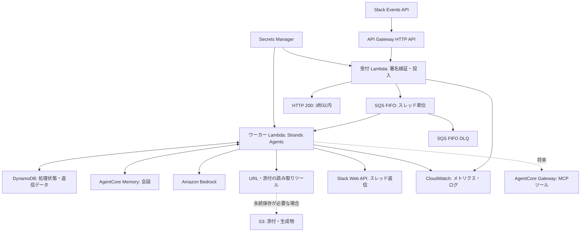

# ADR-0001: LambdaとStrands AgentsによるSlackチャットボットの再構築

- 状態：Proposed
- 作成日：2026-09-06
- 対象：次期チャットボットの実行基盤、非同期処理、会話保存、移行

## 決定案

既存リポジトリを継続し、Amazon API Gateway HTTP API、受付用AWS Lambda、Amazon SQS FIFO、ワーカー用AWS Lambdaで構成する。
ワーカーでPython版Strands Agentsを実行し、Amazon Bedrockを推論に、Amazon Bedrock AgentCore Memoryを会話保存に利用する。
Amazon DynamoDBには処理状態と返信の再送用データを保存する。
Amazon S3は添付・生成物の永続保存が必要になった段階で追加する。

本ADRは設計の提案であり、以下の初期値は検証対象である。
本番切り替えは「導入手順と受け入れ条件」を満たした時点で行う。

## 背景と対象範囲

現行の[Lambdaハンドラー](../../src/lambda_function.py)は、HTTPリクエスト内で履歴取得、URL取得、推論、Slack返信を実行する。
[イベント保存](../../src/dynamodb_utils.py)は作成済みのイベントを重複として扱うため、`processing`のまま失敗したイベントの再送でも処理を終了する。
[Slack連携](../../src/slack_utils.py)は呼び出しごとにSlackからスレッド履歴を取得し、URLや添付を再取得する。
受信本文や生成結果をログへ出力する実装も見直す。

次期版は、単一Slackワークスペース内の`app_mention`を入口とし、スレッドに返信する。
会話の単位はSlackスレッドで、複数ユーザーが同じ会話に参加できる。
通常の会話、URL参照、テキスト添付、スレッド当たり50回答の上限を引き継ぐ。
DM、Slash Commands、一般メッセージの全件取り込み、書き込み系ツールは追加要件として扱う。

次期版の履歴には、ボットへのメンションとその応答を取り込む。
現行の「Slackスレッド全体を毎回読む」動作から変わり、メンションのない発言は自動で文脈に入らない。
既存スレッドの過去履歴も初期移行では取り込まず、新しいスレッドから利用を開始する。
この差分を利用案内と受け入れテストに含める。

## 全体構成

### コンポーネントの責務

| コンポーネント | 責務 |
| --- | --- |
| API Gateway HTTP API | `POST /slack/events`のHTTPS公開 |
| 受付Lambda | Slack署名検証後のイベント投入 |
| SQS FIFO | 非同期配送とスレッド単位の直列化 |
| ワーカーLambda | 会話復元、推論、ツール実行、返信 |
| Strands Agents | モデル呼び出しとツール実行ループ |
| Amazon Bedrock | モデル推論 |
| AgentCore Memory | セッションの永続化 |
| DynamoDB | 冪等性と処理の進捗管理 |
| Secrets Manager | SlackのSigning SecretとBot Tokenの保管 |
| CloudWatch | 障害検知と稼働状況の計測 |

Strands Agentsはアプリケーションに組み込むSDKであり、マネージドサービスとしての会話保存はAgentCore Memoryが担う。
短期記憶は会話イベントを保存し、長期記憶は会話から情報を抽出する機能を提供する。[AgentCore Memory](https://docs.aws.amazon.com/bedrock-agentcore/latest/devguide/memory.html)

エージェント本体の配置先はLambdaとし、AgentCore Runtimeは初期構成に含めない。
MemoryへはLambdaの実行ロールでAPIアクセスする。
AgentCoreの各機能は必要に応じて選択して組み合わせられる。[AgentCore FAQ](https://aws.amazon.com/bedrock/agentcore/faqs/)

## Slackの受付とURL

API GatewayはURL発行だけを目的とする場合は必須ではない。
Lambda Function URLでもHTTPSの入口を作れる。[Lambda Function URL](https://docs.aws.amazon.com/lambda/latest/dg/urls-configuration.html)

### 入口の比較

| 選択肢 | 適する条件 | 本構成での判断 |
| --- | --- | --- |
| API Gateway HTTP API | ルート管理とアクセスログを持つ小規模API | 採用 |
| Lambda Function URL | 単一関数を最小構成で公開 | 入口管理をLambdaから分離するため見送り |
| API Gateway REST API | AWS WAF連携やAPIキー単位の制御が必要 | 要件が生じた時点で再検討 |
| Slack Socket Mode | 常駐接続を維持できる実行基盤 | リクエスト駆動のLambda構成には採用しない |

HTTP APIではステージ・ルートのスロットリングとアクセスログを設定する。
AWS WAFの直接連携が必要ならREST APIを選ぶ。[HTTP APIとREST APIの比較](https://docs.aws.amazon.com/apigateway/latest/developerguide/http-api-vs-rest.html)
Function URLを選ぶ場合、Slackから直接呼ぶ入口は`NONE`認証と公開用リソースポリシーが必要になり、Slack署名検証は同様に必要である。[Function URLのアクセス制御](https://docs.aws.amazon.com/lambda/latest/dg/urls-auth.html)

### 受付処理

1. HTTP APIのpayload format version 2.0を使用し、`isBase64Encoded`を反映して生のリクエスト本文を復元する。
2. JSON解析前の本文に対して`X-Slack-Signature`を検証する。`X-Slack-Request-Timestamp`と現在時刻の差を5分以内に制限し、`v0:{timestamp}:{raw_body}`のHMAC-SHA256を定数時間比較する。
3. 署名検証済みの`url_verification`には`challenge`を返す。通常イベントでは許可した`team_id`と`api_app_id`を照合し、`app_mention`かつ人間の投稿だけを対象にする。
4. 対象イベントを正規化してSQSへ`SendMessage`する。成功確認後にHTTP 200を返す。対象外イベントは200で終了する。
5. キュー投入失敗は5xx、署名不正は401、不正なペイロードは400で終了する。送信結果不明時も5xxとし、再送時の重複を後段で吸収する。

署名検証の手順は[Slack公式仕様](https://docs.slack.dev/authentication/verifying-requests-from-slack/)に従う。
Slackの受信確認期限は3秒であり、タイムアウト等でイベントが再送される。
`X-Slack-Retry-Num`だけを理由に破棄せず、同じイベントIDとして投入する。[Slack Events API](https://docs.slack.dev/apis/events-api/)

受付ではLLM、URL取得、添付取得、Slack Web APIを呼ばない。
Signing Secretは実行環境内に期限付きでキャッシュし、短いSDKタイムアウトと再試行上限を設ける。
受付成功の目標をコールドスタート込みでp99 2秒未満とし、検証で満たせなければパッケージ縮小とProvisioned Concurrencyを比較する。
Lambdaのタイムアウト設定だけではSlackの3秒制約を保証できない。

### キューの契約

`schema_version`、`event_id`、`team_id`、`api_app_id`、`channel_id`、`user_id`、`thread_ts`、`message_ts`、`text`、添付のファイルID、受信時刻を格納する。
`thread_ts`がない投稿では`message_ts`をスレッドの起点とする。
タイムスタンプは文字列のまま保持し、浮動小数点に変換しない。
本文を含む正規化済みメッセージの上限をアプリ側で128 KiBに設定し、上限超過を計測して拒否する。
添付本文と秘密情報はキューに入れない。

`MessageGroupId`は`team_id + channel_id + thread_ts`を曖昧さのない形式で連結してSHA-256にした値、`MessageDeduplicationId`は`team_id + event_id`のSHA-256とする。
同一スレッドの処理を直列化し、異なるスレッドを並列実行する。
FIFOの順序はキューへの投入順であり、Slack側で遅延したイベントまで元の発言順に並べ直す保証は持たせない。

## ワーカーと再処理

### 初期設定

| 設定 | 初期値 |
| --- | --- |
| 受付Lambdaタイムアウト | 3秒 |
| ワーカーLambdaタイムアウト | 120秒 |
| エージェント処理予算 | 90秒 |
| モデル呼び出し上限 | 8回/イベント |
| ツール呼び出し上限 | 5回/イベント |
| 出力トークン上限 | 2,048/モデル呼び出し |
| ワーカーの予約済み同時実行数 | 5 |
| SQSイベントソースの最大同時実行数 | 5 |
| SQSバッチサイズ | 1 |
| SQS可視性タイムアウト | 720秒 |
| ソースキュー保持期間 | 4日 |
| DLQ保持期間 | 14日 |
| `maxReceiveCount` | 5 |
| イベント処理状態の保持期間 | 30日 |

FIFOにはバッチウィンドウを設定しない。
可視性タイムアウトはLambdaタイムアウトの6倍を初期値とする。[LambdaのSQS設定](https://docs.aws.amazon.com/lambda/latest/dg/services-sqs-configure.html)
低い同時実行数から開始し、Bedrockのトークン・リクエスト割り当てと実測値で引き上げる。

90秒の処理予算は各モデル・ツール呼び出しの前後で確認し、HTTP接続・読み取りタイムアウトも残り時間以内にする。
予算を使い切った場合は上限到達の応答を保存し、返信と後処理の時間を確保する。
Lambdaの最大実行時間は15分であるため、長時間の自律処理や承認待ちはジョブ分割、AWS Step Functions、AgentCore Runtimeを別ADRで比較する。[Lambdaタイムアウト](https://docs.aws.amazon.com/lambda/latest/dg/configuration-timeout.html)

### DynamoDBのデータ設計

新規のオンデマンドテーブルを使用し、旧会話テーブルとは分ける。

| キー種別 | 主な保存データ | 用途 |
| --- | --- | --- |
| `EVENT#<team>#<event>` | 状態、リース期限、試行番号、返信本文、Slack投稿ts、失敗分類、TTL | イベント単位の再開 |
| `SESSION#<thread hash>` | Memoryの対応先、回答数、停止理由、最終更新日時 | 会話の対応付けと停止制御 |
| `RATE#<team>#<channel>` | 次回投稿可能時刻 | チャンネル単位の投稿調整 |

イベントレコードの返信本文はUTF-8で64 KiBまでとし、上限を超える応答は短縮する。
生成物の全文保存が必要になればS3へ移し、参照先のみを保存する。
TTLは削除の予約に使用し、期限超過の判定はアプリでも行う。
セッションの停止状態は未解決の間保持し、イベントレコードが消えても自動解除しない。

### 状態遷移と障害境界

通常は`RUNNING → GENERATED → POSTING → COMPLETED`と進む。
条件付き更新で所有者と試行番号を確認し、実行時間を上回る180秒のリースを確保する。
完了済みイベントはSQS処理成功として終了する。
有効なリースを持つイベントは再試行に戻し、未完了の重複を成功扱いで捨てない。
イベントの取得とセッションの実行中イベントIDの設定はDynamoDBトランザクションで行う。
`COMPLETED`への遷移、実行中イベントIDの解除、回答数の加算も同じトランザクションにまとめ、再配送で回答数を増やさない。
別イベントが実行中のままなら後続イベントは推論を始めず、元イベントの状態を確認して再試行または隔離する。

| 障害境界 | 回復方針 |
| --- | --- |
| 推論やMemory書き込みの開始前 | リース期限後に再試行 |
| 推論中・Memory書き込み中の強制終了 | `NEEDS_REVIEW`にしてセッションを停止 |
| `GENERATED`保存後の終了 | 保存済み本文から返信を再開 |
| Slackが明示的に429を返した | `Retry-After`以降に再試行 |
| Slack投稿成功後、ts保存前の終了 | 投稿結果不明として`NEEDS_REVIEW`へ移行 |
| `COMPLETED`後のSQS再配送 | 投稿せず成功終了 |
| スキーマ不正・権限不足等の継続障害 | 再試行上限後にDLQへ移動 |

処理開始直前に実行フェーズを永続化し、次回実行が「開始前」と「実行結果不明」を区別できるようにする。
`GENERATED`はMemoryの保存完了を確認した後に記録する。
セッションマネージャーの途中保存とDynamoDB更新は単一トランザクションにならないため、途中終了を無条件に最初から実行するとユーザー発言やツール結果が重複しうる。
初期版では不明な状態を隔離し、運用者がMemoryのイベントとSlack投稿を照合して、再開または新規セッションへの切り替えを行う。
`NEEDS_REVIEW`とセッション停止をトランザクションで保存できた場合のみ、元メッセージをSQS処理成功として終了する。
保存できなければ失敗を返して配送を継続する。
停止中の後続イベントはモデルやSlackを呼ばずに失敗を返し、最終的にDLQへ残す。
将来の自動復旧ではMemoryイベントの冪等キーとチェックポイント対応を検証する。Memoryの`CreateEvent`には`clientToken`があるが、利用する連携実装が安定した値を渡すかは別に確認する。[CreateEvent](https://docs.aws.amazon.com/bedrock-agentcore/latest/APIReference/API_CreateEvent.html)

`POSTING`を保存してから投稿し、成功時にSlackのtsを保存する。
通信タイムアウトや5xxでは投稿済みの可能性があるため、無条件な再投稿を止める。
既知の投稿tsがあれば`chat.update`で復旧する。
SlackとDynamoDBの間に分散トランザクションはなく、外部投稿のexactly-onceを保証しない。
複数メッセージに分割する場合は分割位置と各投稿tsを保存して同じ手順を適用する。[chat.postMessage](https://docs.slack.dev/reference/methods/chat.postMessage/)

SQS FIFOの重複排除だけに依存せず、30日以内の再投入はイベントレコードで判定する。
SQSの少なくとも1回の配送を前提に実装する。[SQS可視性タイムアウト](https://docs.aws.amazon.com/AWSSimpleQueueService/latest/SQSDeveloperGuide/sqs-visibility-timeout.html)

DLQへ移動したメッセージより後の発言は進みうるため、ワーカーはセッションの停止状態を毎回確認する。
運用者はイベントソースを停止し、対象スレッドの未処理イベントを確認してから復旧する。
DLQ全件の一括再投入は通常手順にせず、後続発言を処理済みなら古い発言を会話末尾へ自動挿入しない。
必要な場合は新しいスレッドで再実行する。

### Slackへの返信制御

返信はBot Tokenを使う`chat.postMessage`で元のスレッドに送る。
Events APIのHTTP応答は受信確認として扱う。
チャンネル当たりおおむね1秒に1投稿の制限に合わせ、DynamoDBの条件付き更新で投稿枠を予約する。
複数スレッドから同じチャンネルへ返信する場合もこの制御を通す。
429の`Retry-After`が残り実行時間を超える場合は、再試行可能時刻を保存してSQSへ失敗を返す。[Slack Web APIのレート制限](https://docs.slack.dev/apis/web-api/rate-limits/)

## 会話保存とエージェント機能

### AgentCore Memoryの使い方

`bedrock-agentcore[strands-agents]`の`AgentCoreMemorySessionManager`を採用候補とし、Strandsの`Agent`へ渡す。
この連携はStrandsの資料でCommunity Contributionと位置付けられているため、SDKと連携パッケージをロックし、復元・途中終了・アップグレードの互換性を検証する。
`batch_size=1`で保存し、正常終了ではコンテキストマネージャーでクローズする。
Lambda強制終了時のflushは保証されない。[StrandsのAgentCore Memory連携](https://strandsagents.com/docs/integrations/session-managers/agentcore-memory/)

`actor_id`は環境・ワークスペース・チャンネルから導出した固定ハッシュ、`session_id`は環境・ワークスペース・チャンネル・スレッド起点から導出した固定ハッシュとする。
小文字16進のSHA-256を使い、MemoryのID文字種と長さに収める。
投稿者ごとにactorを変えると同じスレッドの履歴が分断されるため、チャンネルを会話参加主体として扱い、実際の投稿者はメッセージのメタデータに保持する。
環境ごとにMemoryリソースを分離する。

初期版は短期記憶を30日保持し、長期記憶の抽出は無効にする。
CloudFormationの`AWS::BedrockAgentCore::Memory`で`EventExpiryDuration=30`を指定し、`MemoryStrategies`を設定しない。[MemoryのCloudFormation定義](https://docs.aws.amazon.com/AWSCloudFormation/latest/TemplateReference/aws-resource-bedrockagentcore-memory.html)
スレッドをまたぐユーザー嗜好の共有には、共有範囲と削除要件の追加設計が必要である。
後から長期記憶を有効にする場合は、まずスレッド単位の要約に限定し、namespaceをactorとsessionで分離する。
長期記憶の検索結果を認可判断や処理完了の根拠にはしない。

アプリは署名検証済みのIDからMemoryの参照先を導出し、モデルやユーザー本文に参照先を指定させない。
ワーカーは毎回新しいAgentとセッションマネージャーを作成し、同じ実行環境に別スレッドの会話オブジェクトを残さない。
履歴の保存とモデルに渡す文脈量は分けて考え、モデルの入力上限内へ履歴を制限する。
要約や履歴削減でも未完了のtool use/resultの組を壊さないことを検証する。
Strandsのセッション管理は単一の書き込み主体を前提とするため、FIFOの直列化を維持する。[Strandsのセッション管理](https://strandsagents.com/docs/user-guide/concepts/agents/session-management/)

### Storageの比較

| 選択肢 | 保存対象 | 判断 |
| --- | --- | --- |
| AgentCore Memory | 会話と将来の記憶抽出 | 採用 |
| Strands S3SessionManager | メッセージとエージェント状態 | Memory連携の検証が不成立なら再検討 |
| 独自DynamoDB会話ストア | 独自スキーマの全履歴 | 履歴復元の自作範囲が増えるため見送り |
| DynamoDB処理テーブル | 冪等性と返信再開 | 採用 |
| S3 | 大きな添付や生成物 | 永続保存要件が出た時点で追加 |
| RDS・ベクトルDB | 関係データや独自検索 | 初期要件に該当しないため保留 |

S3SessionManagerはStrands側に用意された永続化実装であり、長期記憶の抽出は別途必要になる。[S3SessionManager](https://strandsagents.com/docs/api/python/strands.session.s3_session_manager/)

### ツールと権限

初期版はURL本文取得とSlackのテキスト添付取得を、上限付きの読み取りツールとして実装する。
URLの取得はHTTPSに限定し、DNS解決後の接続先とリダイレクト先を検査してループバック、プライベート、リンクローカル等へのアクセスを拒否する。
接続先検査と実接続のずれもテストし、取得サイズを1 MiB、取得時間を10秒までに制限する。
添付は許可した種類を1イベント当たり3件まで取得し、同じサイズ上限を適用する。
Slack認証ヘッダーを外部URLやリダイレクト先に転送しない。
取得本文は信頼できない入力としてモデルに渡し、ツール権限はアプリケーションで検査する。

複数サービスのツール共有が必要になればAgentCore Gatewayを追加する。
StrandsのMCPクライアントからIAM認証で接続し、Gatewayが公開する限定したLambdaツールを呼ぶ構成とする。
API GatewayはSlackのHTTP入口、AgentCore Gatewayはエージェントのツール入口という役割で区別する。[AgentCore Gatewayの作成](https://docs.aws.amazon.com/bedrock-agentcore/latest/devguide/gateway-create.html)

外部ユーザーのOAuth資格情報が必要な場合はAgentCore Identityを評価する。
BrowserやCode Interpreter、外部サービスへの書き込みは独立した権限・費用・実行時間の検証後に追加する。
書き込みには、モデルの判断とは独立した利用者認可、確認手順、ツール側の冪等キーを必須とする。

## セキュリティと運用

受付とワーカーのIAMロールを分離する。
受付にはSigning Secretの取得と対象キューへの送信を許可する。
ワーカーには対象キューの受信・削除、処理テーブル、Memoryデータプレーン、採用するBedrockモデル、Bot Tokenへのアクセスを許可する。
Memory作成やIAM変更の権限はデプロイ用ロールに集約する。
秘密値はSecrets Managerから取得し、環境変数には参照先を設定する。

Slackの初期スコープは`app_mentions:read`、`chat:write`、添付取得用の`files:read`を基本とする。
Slack履歴取得を常用する機能を外すため、履歴スコープは復旧方法や将来機能で必要性を確認して追加する。
復旧時の投稿照合はSlack画面でも実施できる。

Lambdaは初期構成ではVPCに接続せず、Slackと公開HTTPSサイトへアクセスする。
プライベートデータソースが必要になった場合はVPC、エンドポイント、外向き通信経路の費用を含めて再設計する。
SQS、DynamoDB、Memory、将来のS3は暗号化を有効にし、S3には公開アクセスのブロックとライフサイクルを設定する。

ログは相関ID、状態、所要時間、トークン数、ツール名、エラー分類を記録する。
本文、取得したページ、添付、認証ヘッダー、署名、秘密値は記録しない。
トレースへモデル入出力を自動収集する設定も同じ方針で確認する。
ログの初期保持期間は14日とする。
削除依頼にはMemoryの会話、将来の長期記憶、DynamoDBの返信データ、キュー内データ、将来のS3を対象として扱う。
Slack上の投稿削除は別の保存先として手順に含める。

### 監視と初期目標

| 指標 | 初期目標・通知条件 |
| --- | --- |
| 受付遅延 | p99 2秒未満 |
| 受付5xx | 5分間で1件以上なら通知 |
| キュー最古メッセージ | 5分超で通知 |
| DLQ件数 | 1件以上で通知 |
| `NEEDS_REVIEW`件数 | 1件以上で通知 |
| 通常応答の所要時間 | 待ち時間込みp95 60秒未満 |
| Lambdaのタイムアウト | 1件以上で通知 |
| Bedrock・Memoryのスロットリング | 件数と再試行率を計測 |

目標は外部APIの応答と負荷試験で評価し、達成できない場合はモデル、文脈量、ツール上限、同時実行数を調整する。
キュー滞留中も受付が200を返すため、受付成功率と回答完了率は別に監視する。
未解決の隔離イベントがある間は、HTTPの成功率だけで正常と判定しない。

## リージョン・モデル・費用

配置先の第一候補は東京リージョンとする。
AgentCoreは機能ごとに提供リージョンが異なるため、Memoryと追加する各機能の対応を実装開始時に確認する。[AgentCoreの対応リージョン](https://docs.aws.amazon.com/bedrock-agentcore/latest/devguide/agentcore-regions.html)
モデルIDまたはInference Profileは設定として外出しし、品質、tool useの互換性、レイテンシ、割り当て、料金で選ぶ。
クロスリージョン推論の利用はデータ処理先の条件と合わせて決定する。

月額は利用量未確定のため固定額にしない。
月間イベント数をN、1イベントの平均モデル呼び出し数をK、各呼び出しの平均入力・出力トークンをI・Oとすると、推論費用は`N × K × (I × 入力単価 + O × 出力単価)`で見積もる。
たとえば計画用に月間10,000イベント、平均2呼び出し、入力4,000・出力500トークンと置くと、入力80,000,000・出力10,000,000トークンになる。
これは予測値であり、実測した履歴増加と再試行を反映して更新する。

基盤費用には受付API、Lambdaのリクエスト数と実行GB秒、SQS操作、DynamoDB操作と保存量、Memoryのイベントと検索、Secrets Manager、CloudWatchを加算する。
Lambdaでは外部API待ちも実行時間として見積もる。
Memoryの長期記憶とGatewayを有効にする際は、それぞれの課金を追加する。[AgentCore料金](https://aws.amazon.com/bedrock/agentcore/pricing/)
本番前に選択モデルと東京リージョンの単価を使って見積もり、月額上限を確定する。
予算通知に加え、モデル呼び出し上限、50回答上限、同時実行上限、ワーカー停止手順を用意する。

## リポジトリとデプロイ

既存リポジトリを継続する。
Slack連携の知見、テストケース、変更履歴を活用でき、アプリケーションと構成の変更を同じPRで追跡できるためである。
新規リポジトリは、所有者・公開範囲・リリース周期を分離する必要が生じた場合に選択する。

次期実装は専用パッケージに受付、ワーカー、会話サービス、ツール、外部サービスのアダプターを分けて置く。
インフラはAWS SAMとCloudFormationで管理する案とし、既存のlambrollによる単一関数デプロイから、キュー・権限・保存先を含むスタックへ移行する。
MemoryはCloudFormationのリソース定義を使用する。
採用するリージョンでスタック作成・更新・保持設定を先行検証し、追加するAgentCore機能にも同じ検証を適用する。
このADRの変更は文書に限定し、現行のデプロイ動作を維持する。

受付パッケージにはStrandsを含めず、ワーカーの依存関係をロックする。
開発環境と本番環境でスタック、キュー、テーブル、Memory、秘密値を分ける。
CIは単体テスト、依存関係と秘密情報の検査、IaC検証を行い、本番デプロイにはGitHub ActionsのOIDCと限定したロールを使用する。
Lambdaのバージョンとエイリアスでロールバック可能にする。

## 導入手順と受け入れ条件

1. 小さな検証用スタックで、LambdaからBedrockとMemoryにアクセスし、Strands連携の保存・復元・権限・タイムアウトを確認する。
2. 受付、FIFO、処理状態を実装し、モデルを呼ばないワーカーで署名検証と重複・障害試験を通す。
3. 単一エージェントの会話とURL・添付ツールを実装する。Memoryの途中保存とSlack投稿結果不明の復旧を含める。
4. 別の検証用Slackアプリで負荷・障害試験を実施する。本番アプリのRequest URLはこの間変更しない。
5. 保存期間、利用量、モデル、データ処理リージョン、機能差分を確定し、運用手順をレビューする。
6. 現行処理の完了を待ち、本番アプリのRequest URLを新しい入口へ切り替える。移行時間帯のイベントを照合し、旧処理と新処理の重複実行を確認する。
7. 問題がある場合は新ワーカーのイベントソースを停止し、実行中処理を収束させてからURLを戻す。新キューの残件と投稿済みイベントを照合し、手動復旧する。
8. 安定稼働後に旧Lambda、旧テーブル、旧デプロイ経路を廃止する。旧データは保存方針に従って削除する。

### 本番切り替え前の試験

| 観点 | 合格条件 |
| --- | --- |
| Slack署名 | 改ざん、期限切れ、base64本文、ヘッダー表記差を正しく処理 |
| 受付 | コールドスタートを含め3秒以内に応答し、投入失敗を200にしない |
| Slack再送 | 投入成功後のHTTP応答消失でも最終返信が重複しない |
| 会話 | 同一スレッドの複数ユーザーで履歴を共有し、別チャンネルへ漏れない |
| FIFO | 同一スレッドへの同時投稿でMemoryの同時書き込みが発生しない |
| 状態管理 | 各永続化境界で強制終了させ、再開または隔離を確認 |
| Slack障害 | 429、5xx、投稿成功後の通信断で定義した回復方針に従う |
| Memory障害 | 部分保存とタイムアウトで無条件な会話再追加をしない |
| DLQ復旧 | 後続発言が存在するケースで会話順序を壊さず復旧できる |
| ツール | SSRF、巨大ファイル、リダイレクト、資格情報転送を拒否 |
| 制限 | 実行予算、ツール回数、出力上限、50回答上限を守る |
| 保持・削除 | 設定期間と削除手順が各保存先で機能する |
| ロールバック | URL復帰とキュー残件の照合を検証環境で再現できる |

### 実装開始時に確定する事項

| 項目 | 判断基準 | 確定期限 |
| --- | --- | --- |
| モデルとInference Profile | 日本語品質、ツール互換性、費用、処理先 | 推論実装前 |
| Memory連携の採用バージョン | 復元と途中失敗の互換性試験 | 会話実装前 |
| IaCのAgentCore対応 | 必要リソースと設定の再現性 | スタック実装前 |
| 月間利用量と月額上限 | 負荷想定と料金試算 | 本番切り替え前 |
| 30日の会話保持方針 | 利用者の期待と削除要件 | 本番切り替え前 |
| S3の追加 | 添付や生成物を後から再取得する必要性 | 永続ファイル機能の実装前 |
| 長期記憶・Gateway・Identity | 具体的な機能と権限共有の要件 | 各機能の追加前 |

## 帰結

Slackの受付を推論時間から分離でき、会話の永続化をマネージドサービスへ委ねられる。
一方、Memory、DynamoDB、Slack間の部分成功はアプリケーションが扱う必要がある。
初期版では不明な実行を隔離する運用負担を受け入れ、重複実行を伴う自動復旧の範囲を限定する。
将来の長時間処理、全スレッド履歴の取り込み、マルチエージェント、書き込み系ツールは、それぞれの制約を確認する追加ADRで決定する。
