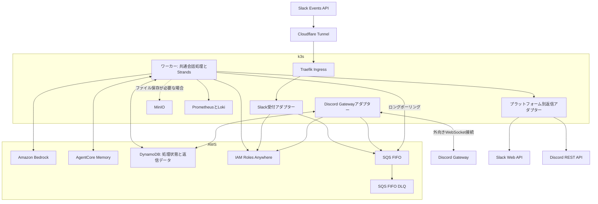

# ADR-002: k3sとAWSによるSlack／Discordチャットボットの再構築

- 状態：Rejected（[ADR-001を採用](001-serverless-strands-chatbot.md#採用判断の記録)）
- 作成日：2026-09-06
- 比較対象：[AWS中心案](001-serverless-strands-chatbot.md)
- 対象：Discord Gatewayを常駐接続するマルチアダプター構成

## 決定案

SlackとDiscordの受付、エージェント実行、ファイル保存をk3sに配置する。
Python版Strands Agentsを共通の会話処理に組み込み、Amazon Bedrock、Amazon Bedrock AgentCore Memory、Amazon DynamoDBはAWSで継続利用する。
永続ジョブキューはAmazon SQS FIFOとし、処理状態はDynamoDBへ集約する。
S3相当のファイル保存には必要に応じてMinIOを使う。

本案はADR-001のAWS中心案と比較する独立した提案である。
AWS中心案はDiscord Gatewayだけをk3sへ置く追加案を持ち、本案はSlack受付と推論ワーカーもk3sへ配置する。

## 背景と対象範囲

現行の[Lambdaハンドラー](../../src/lambda_function.py)はHTTPリクエスト内で推論とSlack返信を行い、受信確認が推論の完了を待つ。
[イベント保存](../../src/dynamodb_utils.py)は作成済みイベントを重複として扱うため、途中失敗した処理の再送から安全に再開できない。
受付と会話処理を分離し、生成済み返信を利用して再開できる状態管理へ移行する。

Slackのメンションに加え、Discordの通常投稿とメンションを受け付ける。
Discord Gatewayの常駐WebSocket接続には既存k3sの容量を利用し、受付と推論をAWSへ置く案と費用および障害範囲を比較する。
会話履歴にはBotへの対象投稿と回答を保存し、Slackのメンションのない発言と既存スレッドの過去履歴は初期移行で取り込まない。
DMと書き込み系ツールは追加要件とする。

### SQSの選定理由

SQS FIFOはノード喪失から独立して受信済みジョブを保持し、配送、可視性タイムアウト、DLQを管理する。
既にBedrockとDynamoDBを使用する構成では、少量のSQS利用料でキューの保守範囲を減らせる。
クラスタ内のNATSやRedis等は永続化と復旧の運用が必要になるため見送る。
PostgreSQLのジョブテーブルも配送制御の実装とDBバックアップが必要になるため採用しない。

## 採用判断の記録

- 決定日：2026-09-06
- 採用案：[ADR-001](001-serverless-strands-chatbot.md#採用判断の記録)

同じ利用量での月額差はSlackのみでUSD 2.68、Discord込みでUSD 3.92であり、ホスト保守、IAM Roles Anywhereの証明書運用、長期保存ファイルを扱う場合のMinIOのバックアップを増やす理由としては小さい。
本案は数時間の停止と受信欠落の許容を前提とするため、Slackの受付と投入済みジョブの処理をホスト保守から切り離せるADR-001をAcceptedとし、本案をRejectedとする。

## AWS中心案との比較

| 比較項目 | AWS中心案 | k3sとAWSのハイブリッド案 |
| --- | --- | --- |
| SlackのHTTP入口 | API Gateway HTTP API | Cloudflare TunnelとTraefik |
| 受付と推論の実行 | Lambda | k3sのDeployment |
| Discord Gateway | k3sの専用Deploymentを追加 | 専用Deploymentで接続 |
| 永続ジョブ | SQS FIFO | SQS FIFO |
| ファイル保存を追加する場合 | S3 | MinIO |
| 推論 | Amazon Bedrock | Amazon Bedrock |
| 会話保存 | AgentCore Memory | AgentCore Memory |
| 処理結果と冪等性 | DynamoDB | DynamoDB |
| 主な基盤費用 | AWSのリクエスト数と実行時間 | SQS、電力、ディスク、運用時間 |
| ローカル障害中の受付 | AWS側の受付は継続可能 | ホストや回線の停止で受付も停止 |
| キューの耐久性 | SQSが管理 | SQSが管理し、ノード停止中も保持期限内は保存 |
| スケール | マネージドなイベントソース | ノード容量内でワーカーを調整 |

## 配置と責務

構成検討には既存のk3s構成資料を参照し、Cloudflare Tunnel、Traefik、MinIO、Prometheus、Lokiを利用する設計とする。
単一ノードとローカル永続ボリュームを基準に評価する。
ここでの容量や可用性は設計上の前提であり、稼働クラスタの空き容量や復旧性能はデプロイ前に実測する。

### k3s上のプロセス

| プロセス | 初期レプリカ数 | 責務 |
| --- | --- | --- |
| Slack受付 | 1 | 署名検証、ジョブの永続化、HTTP応答 |
| Discord Gatewayアダプター | 1 | WebSocket接続、イベント選別、ジョブの永続化 |
| 会話ワーカー | 1 | 同時2会話までの処理と返信 |

受付とGatewayを推論ワーカーから分離し、モデルの応答待ちがHeartbeatやSlackの受信確認を妨げないようにする。
返信アダプターは初期版ではワーカー内のモジュールとする。
ワーカーの並列処理を増やす場合も、プラットフォームのレート制限と会話単位の排他制御を維持する。

Slack用の`POST /slack/events`だけを公開し、MinIOにはIngressを付けない。
Discord GatewayはPodから外向きに接続するため、Discordの受信用URLや公開WebSocketサーバーは不要である。
管理画面の認証とSlackのWebhook認証を分け、Slackの入口を対話型ログインやブラウザ向けチャレンジに転送しない。
署名検証に使うリクエスト本文をプロキシで書き換えない。

## マルチアダプターの契約

共通処理がプラットフォーム固有のSDKオブジェクトを受け取らないよう、受付時に共通イベントへ変換する。

### 共通イベント

| フィールド | 内容 |
| --- | --- |
| `schema_version` | イベント契約のバージョン |
| `platform` | `slack`または`discord` |
| `installation_id` | Botのインストール境界 |
| `tenant_id` | SlackワークスペースまたはDiscordサーバー |
| `event_id` | SlackイベントIDまたはDiscordメッセージID |
| `conversation_id` | アダプターが導出した会話単位 |
| `user_id` | プラットフォーム内の投稿者ID |
| `source_message_id` | 元投稿の識別子 |
| `occurred_at` | 投稿時刻 |
| `received_at` | 受信時刻 |
| `text` | 本文 |
| `attachments` | 添付参照 |
| `reply_target` | プラットフォームと型を持つ返信先 |

`reply_target`はSlackならchannelとthread timestamp、Discordならchannelと元message IDを保持する。
トークンは共通イベントやログに入れず、インストール情報から返信アダプターが取得する。
すべての外部IDは文字列として保持する。
Slackの`conversation_id`はchannelとthread timestampから導出し、thread timestampがない投稿では元投稿のtimestampを使う。

重複排除キーは環境、platform、installation、tenant、event IDから導出する。
会話キーは環境、platform、installation、tenant、conversation IDを曖昧さのない形式で連結し、SHA-256にする。
同じ数値のIDがSlackとDiscordに存在しても混ざらないようにする。
プラットフォームをまたぐユーザー同定と会話共有は初期版に含めない。

### アダプター境界

| インターフェース | 責務 |
| --- | --- |
| 受信アダプター | 認証、許可範囲の確認、正規化、永続化 |
| 会話サービス | 履歴復元、推論、ツール実行、処理状態 |
| 添付アダプター | 認可された添付の取得とサイズ検査 |
| 返信アダプター | 表示形式、分割、投稿、更新、エラー分類 |
| キューアダプター | SQSへの投入、受信、可視性変更、完了後の削除 |

返信アダプターは「成功と投稿ID」「明示的な再試行時刻」「恒久失敗」「投稿結果不明」を共通の結果型として返す。
投稿前に出力を各プラットフォーム向けに変換し、生成文に含まれるメンションを無効化する。
Slackの表示記法とDiscordのMarkdownを同じ文字列として扱わない。
Discordの本文は2,000文字以内に分割し、投稿と更新の両方で`allowed_mentions`を明示する。
分割位置と各投稿IDをDynamoDBへ保存し、再試行では未送信部分だけを対象にする。[Discord Message API](https://docs.discord.com/developers/resources/message)

## Slackの受信

AWS中心案と同じく、生本文のHMAC署名と5分の時刻差を検証する。
`team_id`と`api_app_id`を許可リストで照合し、人間の`app_mention`だけを投入する。
`url_verification`には署名検証後にchallengeを返す。

通常イベントはSQSの`SendMessage`成功後にHTTP 200を返す。
送信全体のタイムアウトは1秒を初期値とし、失敗や結果不明では5xxを返す。
再送時は同じ`MessageDeduplicationId`を使い、重複排除期間を超えた再送はワーカーがDynamoDBで判定する。
Slackが求める3秒以内の受信確認に対し、外部経路込みでp99 2秒未満を目標とする。[Slack Events API](https://docs.slack.dev/apis/events-api/)

プロセスのメモリへ追加した時点では受信成功としない。
SQSへの到達不能やAWS認証障害では受付も停止する。
成功応答済みのジョブは、k3sのノードやディスクを失ってもSQSの保持期限内は残る。

### 停止中の欠落と回復

Slackの再送は有限であり、ホストや回線が長時間停止するとSQSへ投入されないイベントが残る。[Slackの再送方針](https://docs.slack.dev/apis/events-api/#retries)
初期版は`conversations.history`等による自動回収を行わず、運用者が停止開始から復旧までの時間帯を案内し、回答のないメンションの再投稿を依頼する。
元イベントを取得していない場合は欠落の全件列挙もできない。
再投稿は新しいイベントとなるため、SQSに残る処理とDynamoDBの返信状態を照合してから再送を案内する。
4時間の復旧目標は実行環境の復旧時間を指し、停止中のSlackイベントの回収を保証しない。

## Discordの通常メッセージとメンション

### 受信範囲と会話単位

初期版は許可したDiscordサーバー内で、明示的に登録したチャンネルとスレッドを対象にする。
DMはtenantの認可境界を追加設計してから有効にする。

| 受信モード | 対象イベント | 会話単位 |
| --- | --- | --- |
| メンションモード | Botにメンションした人間の投稿 | チャンネルIDまたはDiscordスレッドID |
| 会話専用モード | 許可した場所の人間の通常投稿 | チャンネルIDまたはDiscordスレッドID |

通常チャンネルでは会話が共有されるため、独立した話題はDiscordスレッドに分ける運用とする。
返信は受信元のチャンネルまたはスレッドへ送り、元投稿へのmessage referenceを付ける。
Discordの返信参照だけではSlackのthread timestampと同じ会話境界にならないため、参照先をたどって会話IDを推測しない。
本案の[会話当たりの回答上限](#実行上限の初期値)は50回答とする。
上限に達した会話ではBotが新しいスレッドの作成を案内し、利用者がスレッドを作成して次の会話を開始する。

Botには対象範囲の`VIEW_CHANNEL`、`READ_MESSAGE_HISTORY`、`SEND_MESSAGES`と、スレッド用の`SEND_MESSAGES_IN_THREADS`を付与する。
非公開スレッドはBotを参加させたものだけを対象とし、ロック済みスレッドへの返信失敗は権限エラーとして扱う。[Discordスレッドの権限](https://docs.discord.com/developers/topics/threads)

初期版は`MESSAGE_CREATE`で起動する。
Bot自身、他のBot、Webhook、システムメッセージを除外し、Bot間の応答ループを防ぐ。
編集イベントでは推論を再実行しない。
削除イベントは保存済み会話を自動削除する機能とは分け、保存先を横断する削除手順を用意する。[Discord Gateway Events](https://docs.discord.com/developers/events/gateway-events)

一般の投稿本文を読むためにMessage Content Intentを使用し、Developer Portalとクライアントの両方で有効にする。
必要なGateway intentsは`GUILDS`、`GUILD_MESSAGES`、`MESSAGE_CONTENT`を基本とし、presenceや全メンバー一覧の取得は有効にしない。
アプリの規模や認証状態に応じて必要な承認を確認する。
メンションに関する例外だけでは会話専用モードを提供できない。[discord.pyのIntents説明](https://discordpy.readthedocs.io/en/stable/intents.html)

### 接続と再接続

PythonのDiscordクライアントライブラリを使用し、Heartbeat、再接続、Resumeを管理する。
初期実装候補はdiscord.pyとし、採用バージョンを固定する。
受信コールバックはジョブの永続化までで終了し、ネットワーク処理やCPU処理でイベントループを塞がない。

GatewayにはHeartbeatとセッション再開の仕組みがあるが、永続キューへの保存を確認するアプリケーション単位のACKはない。
同一プロセス内の一時的な切断ではResumeを試み、無効なセッションではIdentifyする。
Identifyの実行はsession start limitと再接続待機に従い、Pod再起動を連続させない。[Discord Gateway](https://docs.discord.com/developers/events/gateway)

Gatewayアダプターは1レプリカ、更新戦略は`Recreate`とする。
複数Podによる同じBot接続を初期構成で作らない。
Heartbeatの疎通と最後のSQS送信成功を別メトリクスにし、SQS障害中に「接続済み」だけで正常と判定しない。

Podの消失やSQS送信前の終了では、SDKの受信済みsequenceと永続化済みジョブがずれる可能性がある。
プロセスをまたぐResumeがライブラリに標準搭載されているとは仮定せず、初期版は再接続後の限定的な履歴照合で補う。
この照合はPod再起動やRecreate更新など、10分以内の短い断絶を対象とする。
対象チャンネルごとに走査カーソルをDynamoDBへ保存し、直近10分を上限にページングして新着投稿を照合する。
初回登録時は登録時刻を開始点とし、過去の通常投稿へ遡って応答しない。
履歴APIからの回収上限は1チャンネル当たり1,000件とし、回収した投稿に元イベントと同じ重複排除キーを使う。
履歴APIの権限とページ上限は[Discord Message API](https://docs.discord.com/developers/resources/message)に従う。

照合中はDynamoDBの会話停止フラグで新規実行を保留する。
新着受信を先にSQSへ投入せず、回収分と投稿順に整列して送信してから停止を解除する。
これとは別に、照合中に届く新着イベントのメモリ待機上限をチャンネル当たり1,000件とする。
どちらかの上限を超えたら接続を止めて通知する。
カーソルはSQS送信成功後に進め、更新失敗時の重複送信はDynamoDBのイベント記録で吸収する。
既にSQSへ投入済みのメッセージを並べ替えることはできないため、投入済みの後続より古い回収分は隔離して確認する。
過去の時点ですでに後続発言を処理した場合は、古い発言を会話末尾へ自動追加せず隔離する。
10分を超える停止、上限超過、削除済み投稿、権限変更、未登録スレッドは完全回収を保証できないため、欠落の可能性を通知して再送を依頼する。
通常メッセージはInteractionsではないため、3秒以内の初回応答や15分の返信トークン制限を適用せず、Bot TokenでREST APIへ返信する。

## SQS FIFOによる永続ジョブキュー

配送、可視性タイムアウト、再配送、DLQはSQSへ委ねる。
アプリケーションは受信ループと処理状態の判定を実装する。
DynamoDBには業務上の処理状態とDiscordの走査カーソルを保存し、会話本文の履歴はAgentCore Memoryへ保存する。

### 投入と受信

`MessageGroupId`には会話キー、`MessageDeduplicationId`には重複排除キーのSHA-256を使う。
本文は正規化イベントとし、認証情報を含めない。
同じ会話の送信をアダプター内で直列化する。
FIFOが保証する順序はSQSへの到着順なので、Slackの遅延再送やDiscordの履歴回収が投稿順と一致するとは仮定しない。[FIFOの配送順序](https://docs.aws.amazon.com/AWSSimpleQueueService/latest/SQSDeveloperGuide/FIFO-queues-understanding-logic.html)

ワーカー内に1本の受信ループと同時2会話の実行枠を設ける。
空き枠があるときだけ`ReceiveMessage`を呼び、`WaitTimeSeconds=20`、`MaxNumberOfMessages=1`とする。
HTTPの読み取りタイムアウトは20秒より長く設定する。
同一バッチ内の会話順序制御を避けるため、初期版はバッチ受信を行わない。
空の応答にも課金されるため、短周期のポーリングは行わない。[ロングポーリング](https://docs.aws.amazon.com/AWSSimpleQueueService/latest/SQSDeveloperGuide/sqs-short-and-long-polling.html)

### 配送と処理結果の整合性

DynamoDBの`RUNNING → GENERATED → POSTING → COMPLETED`を処理状態の基準とし、`COMPLETED`を確認してからSQSの`DeleteMessage`を呼ぶ。
イベントとセッションの確保には条件付きトランザクションを使用する。
回答数の加算、イベント完了、セッションロックの解除も同じトランザクションにまとめる。
SQSとDynamoDBの原子的な更新は要求せず、再配送時に保存済み状態を確認する。

| 障害境界 | 回復方針 |
| --- | --- |
| SQS保存後にSlackへの200が消失 | 同じキーで再送し、処理前に重複を確認 |
| DynamoDBへの到達前にワーカーが終了 | 可視性タイムアウト後に再配送 |
| 推論やMemoryの書き込み中に終了 | 期限切れの実行状態を要確認とし、会話を停止 |
| `GENERATED`保存後に終了 | 保存済みの返信から再開 |
| 投稿結果が不明 | `NEEDS_REVIEW`として会話を停止し、外部投稿を照合 |
| DynamoDB完了後、SQS削除前に終了 | 再配送時に完了を確認し、再投稿せず削除 |
| 受信回数の上限に到達 | SQSのDLQへ移動し、運用者が確認 |

セッションには期限付き所有権と、解決するまで消さない実行中イベントIDを保持する。
各ワーカーは副作用の前に所有者、世代番号、会話停止状態を確認する。
DynamoDBのリースを20秒ごとに更新し、更新失敗時は新しいモデル呼び出しと投稿を止める。
外部APIは世代番号を検査しないため、実行中のまま期限切れになったイベントを自動で再推論せず、元プロセスの停止と結果を確認する。
Memoryの途中保存と外部投稿のexactly-onceは保証しない。

`NEEDS_REVIEW`は正常完了として削除せず、再受信時も推論を行わずDLQへの移動を待つ。
FIFOからDLQへ先頭が移ると後続が配送されるため、DynamoDBの未解決イベントIDで後続の推論も停止する。
DynamoDBへ接続できない場合も推論と削除を行わない。
状態保存前に失敗し続けてDLQへ移ったイベントには停止記録が残らず、通知までに後続が進む可能性がある。
この場合を含む厳密な欠落なしの処理順序は保証せず、DLQの本文と会話状態を照合して再送の要否を判断する。
DLQが発生した際は受信ループを停止して影響する会話を照合し、自動redriveは行わない。[DLQとFIFOの順序への影響](https://docs.aws.amazon.com/AWSSimpleQueueService/latest/SQSDeveloperGuide/sqs-dead-letter-queues.html)

DLQ検知時の停止は全会話の新規処理に及び、1会話の恒久失敗でもBot全体の回答開始が運用者の確認まで止まる。
受付は継続し、後続イベントをSQSへ保存する。
実行中の別会話は通常の完了手順を進める。
運用者がDLQを照合して対象会話に停止状態を記録した後、全体の受信を再開する。
確認済みイベントをDynamoDBへ記録し、同じ隔離メッセージだけを理由に全体停止を繰り返さない。
会話単位だけを自動停止する案は、状態保存前にDLQへ移るケースの検知と隔離制御が増えるため初期版では見送る。

### 再試行、保持、流量制御

可視性タイムアウトは180秒、1試行の実行上限は120秒とする。
正常処理では可視性延長を不要とし、期限を超えて処理を継続しない。
安全に再試行できる失敗は`ChangeMessageVisibility`で最大5分の指数バックオフとjitterを設定し、実行枠を解放する。
外部APIの`retry_after`が長い場合はその待機時間を反映する。
SQSの可視性を変更しても、DynamoDBの未解決状態は解除しない。[可視性タイムアウト](https://docs.aws.amazon.com/AWSSimpleQueueService/latest/SQSDeveloperGuide/sqs-visibility-timeout.html)

ソースキューは4日、同じリージョンのFIFO DLQは14日保持し、`maxReceiveCount=5`を初期値とする。
これは受信回数の上限であり、推論の実行回数とは対応しない。
AWS障害を検知したら受信ループを休止して無用な受信を抑える。
保持期限切れは自動削除であり、DLQへの移動条件ではない。
滞留5分で通知し、停止が長引く場合は4日以内に復旧または退避する。
DynamoDBのイベント記録は30日保持し、それを超える再投入は手動復旧とする。

正規化イベントは128 KiBまでとし、大きい添付は本文に埋め込まない。
全体10,000件または滞留5分を運用通知の目安とし、SQSの概算件数を厳密な投入制限には使わない。
許可したチャンネルと同時2会話の上限で対象範囲とモデル費用を制御する。
過負荷時は受付を停止し、Slackには503、Discordには受信停止と再送方法を通知する。

## AWSに残す会話保存と処理状態

Strands Agentsはk3sのワーカー内で実行し、Bedrockのモデル呼び出しとAgentCore MemoryへのアクセスはHTTPSを使用する。
AgentCore Runtimeは実行先に追加しない。
モデル選定、入力文脈の上限、連携パッケージの互換性試験はAWS中心案と同じ受け入れ条件とする。
AWS側の配置先は東京を第一候補とし、モデルと各サービスのリージョン対応を確認する。
クロスリージョン推論はデータ処理先を確認してから有効にする。

Memoryは環境ごとに分離し、`actor_id`をplatform、installation、tenant、channelから、`session_id`を会話キーから導出する。
Discordスレッドは独立したchannel IDとして扱う。
短期記憶を30日保持し、長期記憶の抽出は初期版では無効にする。
会話ごとにAgentとセッションマネージャーを作り、別会話のオブジェクトを再利用しない。
StrandsのAgentCore Memory連携はバージョンを固定して復元と途中終了を検証する。[AgentCore Memory連携](https://strandsagents.com/docs/integrations/session-managers/agentcore-memory/)

DynamoDBにはイベントの処理状態、生成済み返信、外部投稿ID、回答数、セッション停止状態、プラットフォーム別の返信制限、Discordの走査カーソルを保持する。
既存のAWS中心案と同様に、生成済み返信はUTF-8で64 KiBまでとする。
k3sのディスクを失っても、SQSの未処理ジョブと保存済みの会話、返信の照合情報はAWSに残る。

### 参加者への案内

会話専用モードを有効にする前に、運用者が対象チャンネルとスレッドに記録範囲を案内する。
対象となる人間の通常投稿と添付内容をAWSへ送信して推論に利用し、会話をAgentCore Memoryへ30日保持すること、同じ会話の参加者間で文脈が共有されることを明示する。
案内にはSQSの本文保持期間、DynamoDBの処理記録と返信データの30日保持、削除依頼の窓口も含める。
案内を確認できる状態にしてから通常投稿の取り込みを開始し、モード変更時も通知する。

### k3sからのAWS認証

Slack受付、Discord Gateway、ワーカーはIAM Roles Anywhereで短期資格情報を取得する案とする。
信頼アンカー、証明書を制限したプロファイル、専用IAMロールをAWS側に作成し、`aws_signing_helper credential-process`をBoto3のcredential providerから利用する。
証明書と秘密鍵は各プロセス専用Secretにマウントし、イメージやGitに含めない。[IAM Roles Anywhere](https://docs.aws.amazon.com/rolesanywhere/latest/userguide/introduction.html)、[Credential helper](https://docs.aws.amazon.com/rolesanywhere/latest/userguide/credential-helper.html)

運用者が管理する認証局から専用証明書を発行し、CA秘密鍵はクラスタ外で管理する。
証明書の更新、失効、期限監視、Pod内での資格情報再取得を本番前に検証する。
既存の認証局があることは前提にせず、認証局の運用方式を実装前の決定事項とする。
AWS Private CAを使う場合は固定費を追加して比較する。

OIDCと`AssumeRoleWithWebIdentity`も代案になるが、k3sのServiceAccountを作るだけではAWSとの信頼は成立しない。
採用する場合は公開するissuer discoveryとJWKS、`aud`と`sub`の制限、署名鍵の更新を設計する。[IAM OIDC provider](https://docs.aws.amazon.com/IAM/latest/UserGuide/id_roles_providers_create_oidc.html)
長期IAMアクセスキーを通常運用の既定値にしない。

IAMロールと証明書はプロセスごとに分離する。
Slack受付には対象キューの`SendMessage`だけを付与する。
Discord Gatewayには`SendMessage`とDynamoDBの走査カーソル、履歴照合の停止状態に必要な操作を付与する。
ワーカーには対象キューの受信、削除、可視性変更、属性取得と、指定したBedrockモデル、Memory、DynamoDBの処理用データへの操作を付与する。
DLQの照合とredriveは運用者ロールに限定し、SSE-SQSとTLSを使用する。
SlackとDiscordのBot Tokenは各アダプターに必要な範囲で配布し、Kubernetes Secretの暗号化保存とRBACを確認する。

## ファイルとツール

添付とURL取得はアダプター経由で行い、HTTPS、接続先検査、リダイレクト検査を必須とする。
取得の初期上限は次のとおりとする。

| 項目 | 上限 |
| --- | --- |
| 1ファイルのサイズ | 1 MiB |
| 1取得の時間 | 10秒 |
| 1イベントの添付数 | 3 |

プライベートネットワークへの接続、資格情報の別ホストへの転送、取得本文によるツール権限の変更を拒否する。
k3sではクラスタ内サービスへ到達しうるため、PodのNetworkPolicyとアプリケーションの接続先検査を併用する。

永続ファイルが必要になるまでは、サイズを制限した一時ファイルで処理する。
再試行用の添付キャッシュや生成物保存を追加する場合はMinIOに専用バケットと限定ユーザーを作る。
初期保持期間は24時間とし、外部URLをモデルへ直接渡さず、ワーカーが認可して取得した内容だけをBedrockへ送る。

MinIOはクラスタ内限定とし、SlackやDiscordが直接アクセスできる配信先として扱わない。
初期版の返信はテキストとし、ファイル送信を追加する場合はアダプターが認証付きのプラットフォームAPIへアップロードする。
期限付きURLの添付は再取得できない場合があるため、キャッシュも原本も失った場合は再添付を依頼する。
長期保存する生成物を導入する際は、MinIOの別障害領域へのバックアップと保持期間を追加決定する。

## デプロイと障害復旧

### 実行上限の初期値

| 項目 | 初期値 |
| --- | --- |
| エージェント処理予算 | 90秒 |
| 1試行の上限 | 120秒 |
| モデル呼び出し上限 | 8回 |
| ツール呼び出し上限 | 5回 |
| モデル出力上限 | 2,048トークン/呼び出し |
| 同時会話数 | 全体2 |
| 会話当たりの回答上限 | 50 |
| SQS可視性タイムアウトとセッションリース | 180秒 |
| リース更新間隔 | 20秒 |
| Pod終了猶予 | 150秒 |

Kubernetesはジョブ単位の120秒上限を自動で強制しないため、ワーカーが実行期限と各HTTPタイムアウトを管理する。
キャンセルに応じない処理は子プロセスを終了できる構造とし、その後は結果不明として隔離する。
SIGTERMでは新しい受信を止め、処理中の会話を終了猶予内に完了または隔離してから終了する。
Kubernetesの終了猶予は`preStop`の実行時間も含む。[Podの終了](https://kubernetes.io/docs/concepts/workloads/pods/pod-lifecycle/#pod-termination)

CPUとメモリのrequests／limits、readiness、liveness、startup probeを各Deploymentに設定する。
readinessは仕事を受け付けられる状態を示し、外部API障害だけでlivenessを失敗させて再起動を繰り返さない。
GatewayのRecreate更新による短い受信停止は履歴照合の試験対象にする。
ワーカーの更新中も同時会話数の上限を超えないよう、初期版はワーカーもRecreateとする。

### ノード障害からの復旧

ノード停止中はSQSが保持期限内のジョブを保存する。
運用者が対応開始してから4時間以内の実行環境復旧を目標とし、無人の時間帯は停止が長引く可能性を受け入れる。
SQSの4日保持を超える停止は未処理ジョブを失うため、外部監視と復旧期限の管理を行う。

新しいノードへマニフェストと資格情報を復元した後、まずDynamoDBの実行中状態とDLQを確認する。
結果不明の会話は停止したまま、正常な会話の受信を再開する。
ノード障害など10分を超える停止では、Discordも停止時間帯の案内と利用者への再投稿依頼を回復の既定とする。
直近10分の履歴照合で取得できた分を確認し、それより前の未投入分は自動回収しない。
Slackも[停止中の欠落と回復](#停止中の欠落と回復)に従って再投稿を案内する。
MinIOの24時間キャッシュは再作成可能なデータとして扱う。
長期保存ファイルを追加する場合だけ、別障害領域へのバックアップと復元試験を導入する。

### 監視

PrometheusでGatewayの接続状態、HeartbeatのACK遅延、再接続回数、最終永続化時刻、ジョブ件数、最古ジョブの経過時間、隔離件数、AWS認証失敗を計測する。
SQSの概算滞留件数、最古メッセージの経過時間、DLQ件数を取得し、AWS到達不能と認証期限切れも通知対象とする。
Lokiには本文や資格情報を含めず、相関ID、状態、所要時間、エラー分類を記録する。

通常返信はキュー待ちを含めp95 60秒以内、最古ジョブ5分超と隔離1件以上で通知する。
受付成功率と回答完了率を分けて評価する。
監視も同じクラスタにあるため、ホストや回線の全面停止はクラスタ外からの死活監視で検知する。
通知はこのチャットボットのワーカーを経由させない。

## 費用と採用条件

両案ともDiscord Gatewayには既存k3sの余剰容量を利用する。
一方で、API GatewayとLambdaの従量費用が低トラフィック時に大きいとは限らず、常駐実行とホストの運用まで含めて判断する。

### 同じ利用量で比較する費用

| 費用 | AWS中心案にDiscord Gatewayを追加 | ハイブリッド案 |
| --- | --- | --- |
| 常駐接続 | Gateway用の増分電力と容量 | Gatewayとワーカー用の増分電力と容量 |
| 受付とジョブ | API Gateway、Lambda、SQS | SQSとk3sの実行容量 |
| ファイル | S3保存量と操作 | MinIOの容量と必要時のバックアップ |
| 推論と会話 | Bedrock、Memory、DynamoDB | 同じAWSサービスに外部通信を加味 |
| AWS認証 | 実行ロール | Roles Anywhereと証明書運用 |
| 運用 | AWSサービス設定と監視 | ホスト更新、証明書更新、復旧 |

月間イベント数、入力と出力のトークン数、モデル呼び出し回数は両案で揃える。
追加の電力費は`増分消費電力W ÷ 1,000 × 月間稼働時間 × 電力単価`で見積もる。
Bedrock等のAWS料金に加え、AWSから外部への転送、バックアップ先、証明書運用、ディスク消耗を含める。
Gatewayだけをk3sへ置く場合も、AWS認証とホストの運用費を含める。
金額はモデルと実測利用量を確定した後に料金表から算出し、削減額を先に固定しない。

既存ホストに余裕があり、数時間の実行停止と限定的な受信欠落を許容できる場合は本案が候補になる。
ホスト保守をSlack受付と投入済みジョブの処理から分離したい場合はAWS中心案が有利になる。
両案ともSQSがジョブを保存するが、本案ではAWSへの接続が受付にも必要となる。

## リポジトリと導入手順

アプリケーションは既存リポジトリを継続し、`adapters/slack`、`adapters/discord`、`application`、`infrastructure`の境界を持つ構成にする。
環境に依存するk3sマニフェストは構成リポジトリで管理し、DNSは既存の管理経路に従う。
AWS側のSQS FIFOとDLQ、Memory、DynamoDB、IAM Roles AnywhereはIaCで管理する。
具体的なホスト名や認証情報は環境設定に保持する。

1. 検証用Discord Botでメンションと通常投稿の受信、必要なIntent、再接続、履歴照合を確認する。
2. SQSの受信ループとDynamoDBの状態管理を実装し、モデルなしで順序、重複、再配送、DLQを試験する。
3. AWSの短期資格情報を構成し、各プロセスから必要なSQS、Bedrock、Memory、DynamoDBへアクセスする。
4. 共通会話サービスと各返信アダプターを接続し、別会話への漏えいと投稿結果不明時の隔離を検証する。
5. ノード再作成とSQSからの再開を試験し、容量、運用担当、停止許容時間、費用を確定する。
6. 固定digestのコンテナを公開し、構成リポジトリのPRでDeploymentを追加する。
7. Discordを許可した場所だけで開始し、Slackは別アプリで検証後にRequest URLを切り替える。
8. 旧処理と新処理の完了状態を照合し、残件を処理してから旧実行環境を廃止する。

ロールバックでは新しい受信を止め、Gatewayを切断し、実行中の処理を完了または隔離してから旧イメージへ戻す。
SQSイベントとDynamoDB項目は直前のイメージでも読める追加変更を基本とする。
SlackのURLを旧入口へ戻す場合も、SQSの未処理ジョブを無条件に旧系へ再投入しない。
Discordには現行Lambda版の代替機能がないため、旧Discordイメージがない初回導入の失敗時はDiscord機能を停止する。

### 本番前の追加試験

| 観点 | 合格条件 |
| --- | --- |
| マルチアダプター | 同じID値でもプラットフォーム間で会話と重複判定が混ざらない |
| Discord受信 | 通常投稿とメンションに応答し、BotとWebhookを除外する |
| Gateway切断 | Resume、Identify、Pod再起動、履歴回収上限を再現できる |
| Gateway更新 | 二重接続を作らず、受信停止と回収結果を観測できる |
| SQS到達不能 | Slackは成功応答を返さず、Discordは未保存を検知する |
| 会話順序 | 再試行中の先頭ジョブを後続が追い越さない |
| AWS到達不能 | キューを保持し、復旧後に完了済み処理を再実行しない |
| リース喪失 | 古いプロセスの継続中に別プロセスが副作用を再実行しない |
| 返信 | 429と通信断を区別し、分割済み投稿のIDを保持する |
| ノード再作成 | SQSとDynamoDBから再開し、完了済み返信を重複させない |
| DLQ | 全体停止、対象会話の隔離、正常会話の再開を検証する |
| 長時間停止 | SlackとDiscordの未投入分を特定できる範囲と再投稿案内を確認する |
| 会話専用モード | 記録範囲と保持期間の案内後に有効化する |
| 証明書 | 更新、失効、期限切れ、短期資格情報の再取得を確認する |
| 外部監視 | クラスタ全停止でも別経路で検知できる |

Discordの送信はAPIのレート制限ヘッダーと`retry_after`に従う。
ワーカー間でBot単位のglobal制限とルート単位の制限を共有し、固定の投稿間隔だけで制御しない。[Discord Rate Limits](https://docs.discord.com/developers/topics/rate-limits)

### 採用前に確定する事項

| 項目 | 判断基準 |
| --- | --- |
| 許可チャンネルとモード | 通常投稿をすべて応答対象にしてよい範囲 |
| SDKと必要なIntents | 通常投稿の取得権限と再接続の挙動 |
| ノード容量 | 同時2会話と既存アプリが共存できる実測値 |
| SQSの保持と通知 | 4日の保持期限内に復旧または退避できる運用 |
| CAの運用方式 | 証明書更新と失効を継続できる手順と費用 |
| 月額と運用負担 | Discordを含む同一条件での両案比較 |
| 停止と欠落の許容範囲 | 履歴回収できない場合に利用者の再送で運用できるか |

## 帰結

Discordの常駐接続と共通の会話処理を既存k3s上で実行し、推論と会話保存にはAWSのマネージドサービスを利用できる。
SQSが配送を管理するため、独自のジョブDBとバックアップ運用を省ける。
証明書更新、ローカル障害からの実行環境復旧、結果不明時の照合は運用に残る。
DLQの検知時には全会話の新規処理を一時停止するため、運用者の応答時間も可用性に影響する。
採用判断は常駐接続の費用と、受付停止および受信欠落の許容範囲で行う。

## コスト試算：1日2会話、各5往復、Claude Opus 5

### 共通の計算条件

料金確認日、モデル単価、トークン量、無料枠の扱い、回答量別の感度分析は[ADR-001の共通試算](001-serverless-strands-chatbot.md#共通の計算条件)に従う。
SlackとDiscordを合わせて月60会話、300回答とし、推論USD 14.25/月、AgentCore Memory USD 0.15/月を共通費用として計上する。
DynamoDBも同じ月30,000 WRU、3,000 RRU、保存0.01 GBの計算枠を使い、Discordのカーソル更新を含めてUSD 0.02473/月とする。
実装後にConsumedCapacityで計算枠を更新する。

### ハイブリッド案の月額

AWS側にはSQS、推論、会話保存、処理状態、クラスタへ返すデータの転送を計上する。
IAM Roles Anywhereは追加サービス料金なしとし、CAは自己管理する仮定を置く。[IAM Roles Anywhereの料金案内](https://aws.amazon.com/about-aws/whats-new/2022/07/aws-identity-access-management-iam-roles-anywhere-workloads-outside-aws/)

| AWSの費目 | 月間計算 | 月額 USD |
| --- | --- | ---: |
| Opus 5 | 共通の推論計算 | 14.25000 |
| AgentCore Memory | 600イベント | 0.15000 |
| DynamoDB | 30,000 WRU、3,000 RRU、0.01 GB | 0.02473 |
| SQS FIFO | 130,500リクエスト相当 × USD 0.50/100万 | 0.06525 |
| AWSからの転送 | 0.01 GB × 0.114 | 0.00114 |
| IAM Roles Anywhere | 自己管理CAを利用 | 0.00000 |
| AWS側の合計 | 丸め前の金額を合算 | 14.49112 |

受信ループ1本の20秒ロングポーリングを30日継続すると、空受信の目安は`30 × 86,400 ÷ 20 = 129,600`回となる。
これに300件の送信、受信、削除を各1回加え、`(129,600 + 900) × 0.50 ÷ 1,000,000 = USD 0.06525/月`を計上する。
基本ケースのメッセージは64 KiB以下とし、再試行、可視性変更、監視用APIは別途加算する。[SQSの東京料金データ](https://pricing.us-east-1.amazonaws.com/offers/v1.0/aws/AWSQueueService/current/ap-northeast-1/index.json)

転送量は小規模なテキスト会話と履歴取得で0.01 GB/月を仮定し、無料枠控除前の東京単価を適用した。[転送の東京料金データ](https://pricing.us-east-1.amazonaws.com/offers/v1.0/aws/AWSDataTransfer/current/ap-northeast-1/index.json)
AWS Private CAを新設する構成へ変更した場合は、この合計にCA費用を追加する。

### k3s側の増分費用

ホストと回線をすでに常時稼働させている場合の増分を計算する。
アプリと監視を加えた増分消費電力を5 W、電力単価を35円/kWhと仮定すると、`5 ÷ 1,000 × 720 × 35 = 126円/月`となる。
消費電力と電力単価には比較用の仮定を置いており、導入後に実測値と契約値へ置き換える。

| k3s側の費目 | 月額の扱い |
| --- | --- |
| 増分電力 | 126円 |
| アプリと任意のMinIOのディスク | 既存容量内なら追加購入費0、増設時は償却費を加算 |
| Cloudflare TunnelとDNS | 既存の契約とドメインを利用し、増分請求0と仮定 |
| PrometheusとLoki | 既存基盤を共用し、増分を電力と容量に含める |
| 長期保存ファイルのバックアップ | 導入する場合に月額費用Bを加算 |
| 証明書更新と復旧作業 | 月間作業時間H × 時間単価Rを加算 |

MinIOで長期保存ファイルを扱う場合は、保存量と別障害領域へのバックアップ費用Bを追加する。
基本ケースのテキスト会話ではBを0とする。

したがって月額は、約USD 14.49に126円とバックアップ等の実費を加えた金額となる。
比較のために1 USD＝150円という仮の換算率を置くと、`USD 14.49112 + 126 ÷ 150 = 約USD 15.33/月`にBと運用費を加える。
換算率は計算用であり、現在の為替レートを示すものではない。

### 両案の比較結果

| 構成 | 対応範囲 | 比較用の月額 USD |
| --- | --- | ---: |
| AWS中心案 | Slack | 18.01 |
| ハイブリッド案 | Slack | 15.33 |
| AWS中心案とk3s Gateway | SlackとDiscord | 19.25 |
| ハイブリッド案 | SlackとDiscord | 15.33 |

ハイブリッド案のSlackのみの概算も、同じ月300回答と増分電力5 Wの計算枠を使用する。
Discordを外した電力差は未実測のため、両方の対応範囲で同額を置く。
人件費等の共通除外項目は両案に別途加算し、ハイブリッド案で増設や長期保存ファイルのバックアップが必要ならその費用も加える。

AWS中心案のDiscord追加分はBot TokenのUSD 0.40050とk3sの増分電力126円である。
詳細は[Gatewayだけをk3sへ置く場合の月額試算](001-serverless-strands-chatbot.md#discord-gatewayだけをk3sで常駐させる場合)を参照する。

同じDiscord対応まで含めると、上記の仮定ではハイブリッド案に月額約USD 3.92の差が生じる。
この差からバックアップ費用と追加運用費を差し引いて判断する。
Slackだけなら差は約USD 2.68に縮まり、低利用量ではLambdaの費用削減だけを理由に運用対象を増やす効果は小さい。
差額は丸め前の数値で算出した。

この計算は既存設備の増分比較であり、ホスト本体、回線、ドメイン等を新設する総所有費用を表さない。
両案とも開発費、既存Slack／Discord契約、CIとイメージ保管を除外している。
全サービスを新設する場合やバックアップ先を追加契約する場合は、その固定費を加えて比較する。
