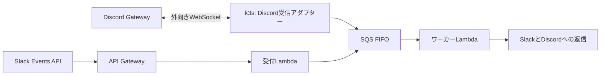

# PRD: Discord対応

- 作成日：2026-09-24
- 関連：[ADR-001 追加案：Discord Gatewayだけをk3sへ配置](../adr/001-serverless-strands-chatbot.md#追加案discord-gatewayだけをk3sへ配置)

## 概要

既存のSlackチャットボットを、Discordのメンションでも使えるようにする。
DiscordはGatewayへの常駐接続がないと投稿を受け取れないため、受信アダプターだけをk3sに置き、キュー以降はSlackと同じAWSの構成で処理する。
利用者は所有者と、所有者が招いた少人数とする。

## 対象範囲

| 区分 | 項目 |
| --- | --- |
| 含む | 許可したサーバーとチャンネルでのメンションへの応答 |
| 含む | URL参照、回答上限など、Slackと同じ会話機能 |
| 含まない | DM、メンションのない投稿への応答、スラッシュコマンド |
| 含まない | 添付の読み込み。[#62](https://github.com/karia/ai_chatbot/issues/62)で扱う |
| 含まない | 停止中に届いたメンションの回収 |

## 振る舞い

| 項目 | 振る舞い |
| --- | --- |
| 呼び出し | 許可したサーバーとチャンネルで、人間がBotにメンションした投稿だけに応答する |
| 無視する投稿 | Bot、Webhook、システムメッセージ、DM、投稿の編集 |
| 会話の単位 | チャンネルでメンションされたら、その投稿からスレッドを作って返信する。スレッド内でメンションされたら、そのスレッドの会話として続ける |
| 文脈 | スレッド内のメンションとBotの返信だけを文脈に含める |
| 回答上限 | 1会話100回答とし、Slackと揃える |
| 返信 | Discordの文字数上限に合わせて分割し、生成文中のメンションで通知を飛ばさない |
| 停止中 | Botはオフラインと表示され、届いたメンションは失われる。利用者は復旧後に再投稿する |

## 構成

| 部品 | 役割 | 変更 |
| --- | --- | --- |
| Discord受信アダプター | Gatewayへの常駐接続、許可範囲とメンションの選別、キューへの投入 | 新規 |
| SQS FIFO | SlackとDiscordのイベントを同じキューで運ぶ | イベントにプラットフォームの区別を追加 |
| ワーカーLambda | プラットフォームに応じてDiscordへ返信する | Discordへの返信を追加 |
| DynamoDBとAgentCore Memory | 処理状態と会話を保存する | プラットフォームごとにキーを分ける |

## 要件と制約

### Slackへの影響

- Discord対応のデプロイ中にキューへ残っているSlackのイベントも処理できること。
- 既存のSlackの会話が、デプロイ後も同じ文脈で続くこと。
- SlackとDiscordで同じ値のIDがあっても、処理状態と会話が混ざらないこと。

### 受信アダプター

- 1レプリカで動かし、同じBotの接続を複数作らない。
- Gatewayのintentは、メンションされた投稿を受け取るのに必要な範囲に限る。特権のMessage Content Intentは使わない。
- 公開URLやIngressは持たない。

### 認証と秘密情報

- k3sからAWSへは短期資格情報で認証し、長期のアクセスキーは使わない。
- 受信アダプターの権限は、対象キューへのメッセージ送信だけとする。
- 認証方式はIAM Roles Anywhereを有力案とし、実装で確かめてから確定する。
  - IAM Roles Anywhereは、変更がこのアプリとAWS側で閉じる。証明書の更新が運用に加わる。
  - OIDCは証明書の更新が不要だが、k3sのAPIサーバーのissuer設定をクラスタ全体で変え、検証用の公開鍵を公開する必要がある。
- Discord Bot Tokenは、受信用にk3sのSecret、返信用にSecrets Managerへ置く。

### 障害時の扱い

- 受信アダプターが停止したら、k3sが再起動する。
- キューへ投入した後の処理と監視は、既存のワーカーとCloudWatchアラームに従う。
- ロールバックは受信アダプターを0レプリカにして行い、キューの残件はワーカーが処理する。

## 完了条件

- 許可したチャンネルでBotにメンションすると、スレッドが作られて返信が届く。
- そのスレッドで続けてメンションすると、前の発言を踏まえて返信が届く。
- 許可していないチャンネルのメンションには応答しない。
- 受信アダプターの再起動後、新しいメンションに応答する。
- Slackでの会話が従来どおり動く。
